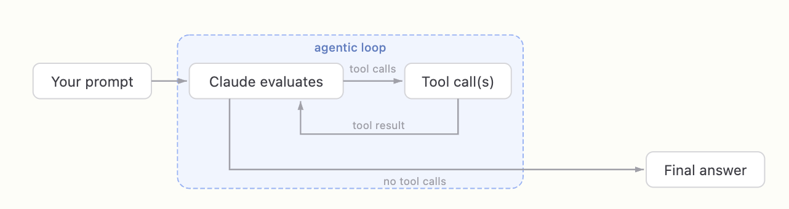
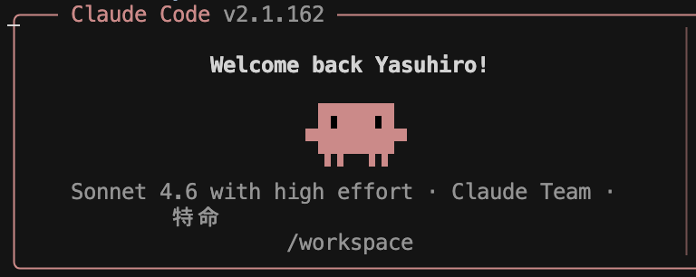
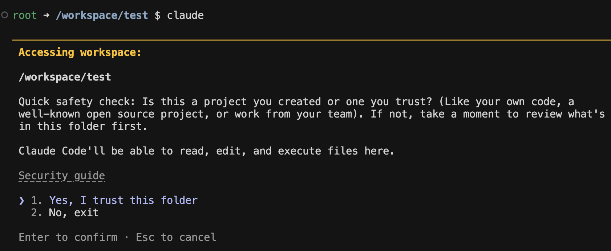
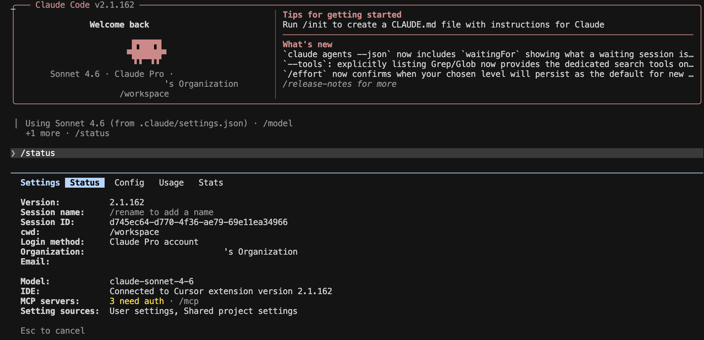
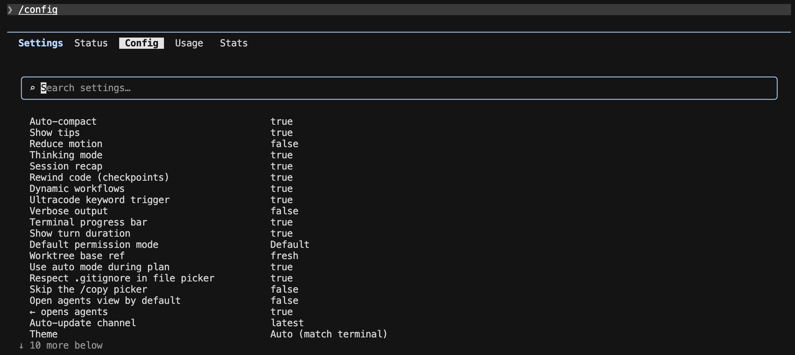
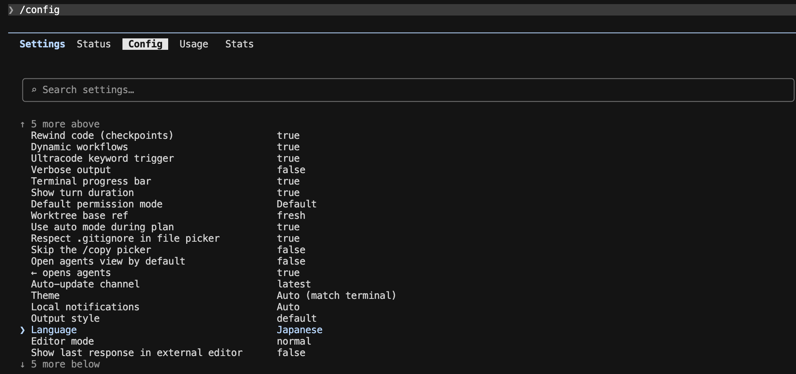
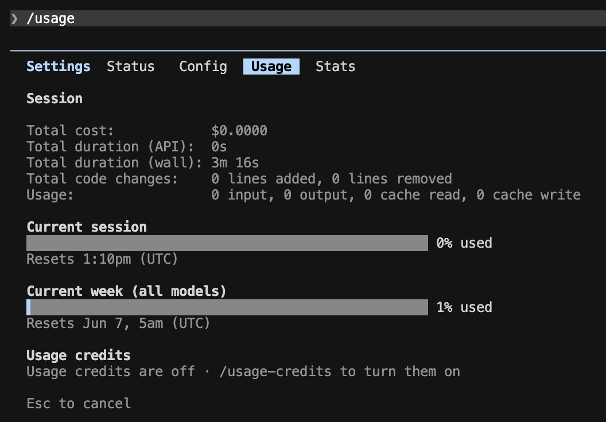
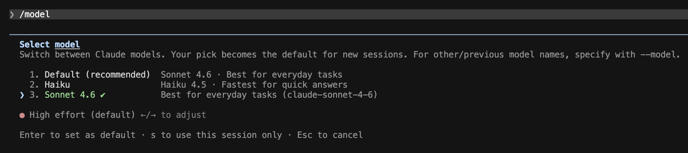
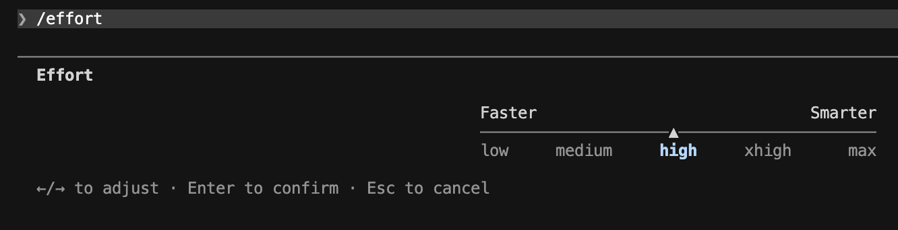
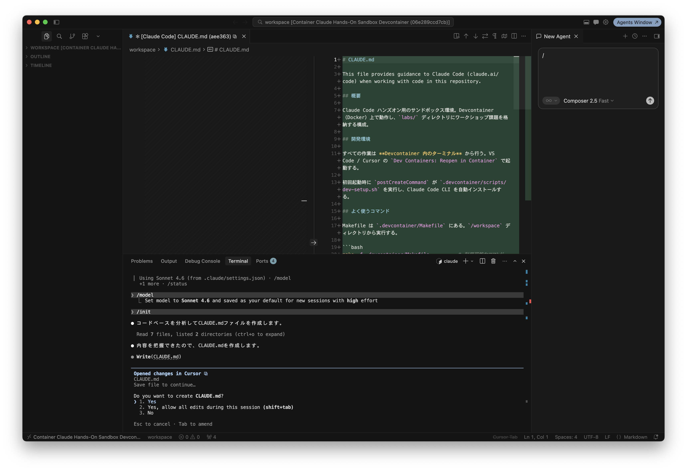

# Claude Code ハンズオン

## ハンズオン概要

### 対象

* ソフトウェア開発エンジニア
* 前提：
  * CLI や Git の基本操作には慣れている
  * Claude Code は未経験 〜 入門レベル
  * AI 駆動開発（Agentic Coding）を実践したい方

### ゴール

本コース終了後、受講者が以下を実施できる状態を目指す。

* Claude Code の基本操作・コマンド体系を理解し、日常業務に導入できる
* [1] Claude Code を使って **ソースコードの解析** を実行できる
* [2] Claude Code を使って **ソフトウェア開発** を実行できる
* [3] Claude Code を使って **チーム開発** を実行できる

### 前提知識

* Git / GitHub の基本操作
* ターミナル操作
* JavaScript / TypeScript または Python の基本
* VS Code 等のエディタ利用経験

### 前提環境

* Claudeサブスクリプションが各自に提供されている
* macOS / Linux / Windows PC
* Cursor / VSCodeが入っている
* devcontainerのサンドボックス環境が入っている(Docker入り)
* 以下はContainer内の状態
  * Claude Codeインストール済み
  * Gitコマンド、および、ghコマンドが入っている
  * Laravel 12+ が入っている

### コース構成（60分 × 3回）

| 回 | テーマ | 主な内容 | 実践 |
|---|---|---|---|
| 第1回 | Claude Code の基本 | Claude Code とは / 基本的な使い方 / コマンド | Claude Code を使ったソースコード解析 |
| 第2回 | Claude Code を使ったソフトウェア開発 | CLAUDE.md / メモリ / Skills / Hooks | Claude Code を使ったコード変更 |
| 第3回 | Claude Code を使ったチーム開発 | CLAUDE.md・Skills の共有 / コンテキスト管理 | チーム開発フローの体験 |

---

# 第1回：Claude Code の基本

## テーマ

「目標：Claude Code の基本操作・コマンド体系を理解し、日常業務で利用できるようになる」

## 到達目標

* Claude Code の基本設定を理解する
* 主要なスラッシュコマンド・特殊プレフィックス・キーボードショートカットを使える
* 既存リポジトリに対して、構造把握 → 該当箇所の特定 → 質問 → サマリ取得の一連を回せる

## 時間配分（60分）

| #  | 内容                          | 時間 |
|----|-------------------------------|------|
| 1  | オープニング                  | 3分  |
| 2  | Claude Code とは？            | 10分 |
| 3  | 基本的な使い方                | 15分 |
| 4  | Claude Code を使ってみよう！  | 5分  |
| 5  | コマンド                      | 8分  |
| 6  | Claude Code の設定ファイル    | 4分  |
| 7  | 実践：ソースコードの解析      | 12分 |
| 8  | まとめ                        | 3分  |

---

### 2. Claude Code とは？（10分）

#### 2-1. Claude Code（2分）

* Anthropic が提供する **エージェント型コーディングツール**
* CLI（ターミナル）/ VS Code / JetBrains / Claude Desktop / Web (`claude.ai/code`) の **5つの入口** がある
* 本コースでは **CLI（ターミナル）** を中心に扱う

#### 2-2. Claude.ai との違い（2分）

| 観点          | Claude.ai（チャット）   | Claude Code（エージェント）         |
|---------------|--------------------------|--------------------------------------|
| ファイルアクセス | コピペで渡した範囲のみ  | ローカルファイルに直接アクセス       |
| 実行           | テキスト返答のみ         | ファイル編集・コマンド実行を自分で行う |
| ループ         | 人間が結果を貼り戻す     | 自分でエラーを読み、自分で直す         |
| 必要な仕組み   | ─                        | **承認モデル**（ハーネス）              |

#### 2-3. エージェントの動き（3分）

##### エージェントループ



1. **プロンプトを受け取る。** ユーザの入力に加えて、Claude Code が用意する指示（システムプロンプト）・使えるツールの一覧・これまでの会話履歴をまとめて受け取る。
2. **評価して応答する。** Claude が今の状況を見て、どう進めるか決める。テキストで答える／ツールを使う（ファイル読込・編集・コマンド実行など）／その両方、のいずれか。
3. **ツールを実行する。** 要求されたツールを実行し、結果を Claude に返す。この結果が次の判断材料になる。Hooks を使えば、ツールの実行を **実行前に止めたり書き換えたり** できる（第2回）。
4. **繰り返す。** ステップ 2 と 3 を繰り返す。この 1 サイクルが **1 ターン**。ツールを使わずに答えだけ返せる状態になるまで続く。
5. **結果を返す。** 最終的な回答テキストを返し、その作業で使った **トークン量・コスト・セッション ID** も確認できる（`/usage` や `/status` で見られる）。

ユーザは **ループの途中で割り込み・方針修正・コンテキスト追加** ができる。

#### 2-4. 用語説明（3分）

##### セッション

* `claude` の起動から終了までの **1つの対話単位**。会話履歴（コンテキスト）はセッションごとに保持される
* 終了しても履歴は残っており、`claude --continue`（直前）や `claude -r`（一覧から選択）で再開できる
* セッションが変わるとコンテキストはまっさらになる — **1タスク1セッション** が使い方の基本

##### モデル

ここではLarge Language Model (LLM)を指す
Anthropic社が提供するモデルファミリー
- Opus — 最も高性能。複雑な設計判断・大規模なリファクタリング向け
- Sonnet — 性能、速度、コストのバランス型。日常的な開発タスクの主力
- Haiku — 最速・低コスト。簡単な質問や定型作業向け

##### コンテキスト

* 会話・ファイル内容・コマンド出力すべてが **コンテキストウィンドウ** に積まれる
* 上限に近づくと **自動コンパクション**（要約圧縮）が走る — **情報のロスを伴う**

##### トークン

* LLM が文章を処理する **最小単位**（英語は約4文字 ≒ 1トークン、日本語は1〜2文字 ≒ 1トークン）
* コンテキストウィンドウの上限はトークン数で決まる（例：200K トークン）
* 利用量（レートリミット）も入出力のトークン数で計算される — `/usage` で確認できるのはこれ

##### ハーネス

* モデル（LLM）を実用的なエージェントとして動かすための **周辺機構の総称**
* ツール実行・パーミッション管理・コンテキスト管理（コンパクション）・セッション管理などを担う
* **Claude Code = モデル + ハーネス**。同じモデルでもハーネスの出来でエージェントの性能は大きく変わる

---

### 3. 基本的な使い方（15分）

#### 3-1. インストール（3分）

##### macOS / Linux / WSL

```bash
# 推奨: 公式インストーラ（auto-update 対応）
curl -fsSL https://claude.ai/install.sh | bash

# 代替: Homebrew（auto-update なし）
brew install --cask claude-code
```

##### Windows

```powershell
# PowerShell（推奨）
Invoke-RestMethod https://claude.ai/install.ps1 | Invoke-Expression
```

```cmd
# CMD
curl -fsSL https://claude.ai/install.cmd -o install.cmd && install.cmd
```

##### 動作確認

```bash
cd <あなたのプロジェクト>
claude
```
* テーマ選択 → サインイン方法選択（Claude Pro/Max/Enterprise / API キー / Bedrock 等）
* 起動ディレクトリ配下に **すべてアクセスできる** → 機密ディレクトリでは起動しない

起動に成功すると、以下のようなウェルカム画面が表示される。



新しいフォルダで初めて起動すると、**そのフォルダを信頼するか** の確認が表示される。



* Claude Code は起動ディレクトリ配下を **読み取り・編集・コマンド実行** できる。そのための起動時にユーザに確認を行います（ハーネス機能）
* 自分が作った／信頼できるプロジェクト（自分のコード・有名な OSS・チームの成果物）なら `1. Yes, I trust this folder`
* 心当たりのないフォルダなら、中身を確認するまでは `2. No, exit` で抜ける

##### 初回サインイン

* 初回起動時はブラウザが開き、Claude アカウントでのサインイン（サブスクリプションの認証）が行われる

#### 3-2. 起動・終了・再開（2分）

| 操作                     | 方法                                   |
|--------------------------|----------------------------------------|
| 起動                     | プロジェクト直下で `claude`            |
| 終了                     | `Ctrl + C` を 2 回 / `/exit`           |
| **直前の続きから再開**   | `claude --continue`                    |
| 過去のセッションを選んで再開 | `claude -r`（`--resume`）           |
| セッションに名前を付ける | `claude -n <name>`（`--name <name>`）  |
| 非対話で 1 問だけ        | `claude -p "..."`                      |

##### パーミッションスキップ（上級者向け）

| オプション                              | 挙動                                                                 |
|-----------------------------------------|----------------------------------------------------------------------|
| `--dangerously-skip-permissions`        | すべてのパーミッション確認をスキップして実行する                     |
| `--allow-dangerously-skip-permissions`  | スキップを既定では無効のまま、セッション中に選択できるようにする     |

> ⚠️ いずれも **インターネットアクセスのないサンドボックス環境でのみ** 推奨。本コースの devcontainer のような隔離環境以外では使わないこと。

#### 3-3. スラッシュコマンド（7分）

まず最初に実施しておきたいコマンドを順に紹介する。

##### `/status` — セッション状態の確認

バージョン・サインイン情報・使用モデル・MCP サーバの状態など、現在のセッションの全体像を一覧表示する。「いま自分がどの環境・どのモデルで動いているか」を最初に確認する習慣をつける。



##### `/config` — 設定の確認・変更

Auto-compact / Thinking mode / 既定のパーミッションモードなど、Claude Code の動作設定を対話的に確認・変更できる。



設定項目の `Language` を変更すると、Claude Code の出力言語を日本語にできる。



##### `/usage` — 利用量の確認

現在のセッション・週単位の利用量（レートリミットの消費状況）を確認できる。リセット時刻も表示されるので、長時間の作業前にチェックすると安心。



##### `/model` — モデルの切り替え

用途に応じてモデルを切り替える。日常タスクは Sonnet、素早い回答が欲しいときは Haiku、といった使い分けができる。



##### `/effort` — 思考の深さの調整

`low` 〜 `max` の5段階で「速さ ⇔ 賢さ」のトレードオフを調整する。簡単な質問は低く、難しい設計判断は高く。



##### `/init` — CLAUDE.md の生成

リポジトリ全体を解析して、プロジェクトメモリ（`CLAUDE.md`）を自動生成する。プロジェクトで最初に一度実行しておくと、以後のセッションで Claude がプロジェクトの構造・規約を踏まえて動くようになる。



生成された `CLAUDE.md` は、**`claude` を起動したディレクトリ（プロジェクトルート）直下** に作成される。

```
<プロジェクトルート>/
├── CLAUDE.md   ← ここに作成される
├── app/
├── routes/
└── ...
```

##### その他の基本コマンド

| コマンド          | 説明                                               |
|-------------------|----------------------------------------------------|
| `/help`           | コマンド一覧                                       |
| `/exit`           | セッション終了                                     |

##### 演習1

紹介したコマンドを実際に実行して、自分の環境を確認・整備する。

1. プロジェクト直下で `claude` を起動する
2. `/status` で バージョン・サインイン状態・使用モデルを確認する
3. `/config` で `Language` を `Japanese` に変更する
4. `/usage` で現在の利用量とリセット時刻を確認する
5. `/model` と `/effort` で現在の設定を確認する（変更してもよい）
6. `/init` を実行して `CLAUDE.md` を生成し、どんな内容が書かれたか眺めてみる

#### 3-4. 承認モードと Plan Mode（3分）

| モード         | ステータスバー表示                  | 挙動                                                                 |
|----------------|-------------------------------------|----------------------------------------------------------------------|
| Default        | （表示なし）`? for shortcuts`       | 標準動作。各ツールの初回使用時に承認を求める                         |
| Accept Edits   | `▶▶ accept edits on`                | ファイル編集と一般的なファイル操作（`mkdir` `mv` `cp` 等）は自動承認、それ以外のコマンドは承認 |
| Plan Mode      | `⏸ plan mode on`                    | **読み取り専用** ツールだけで計画を立てる（編集しない）              |
| Auto           | `▶▶ auto mode on`                   | 安全チェック付きでツール呼び出しを **自動承認**（研究プレビュー）    |

`Shift + Tab` で上記4つを循環切り替え。

##### 使い分けの目安

* 新規領域・本番リポジトリ → **Default**
* テストが厚い既存領域 → **Accept Edits**
* 下調べ・計画したいだけ → **Plan Mode**（**ファイル編集しない**）
* 隔離されたサンドボックスで全部任せたい → **Auto**

> Plan Mode は「コードを書かずに計画だけを出させる」モード。読み取り専用ツールしか使わないので、何回赤入れしても安全。

##### 演習2

* `Shift + Tab` で上記4つのモードを切り替えてみましょう。

### 4. Claude Code を使ってみよう！（5分）

ここまでの内容を使って、実際に Claude Code でアプリを1本作ってみる。題材は PHP の「Hello world」。承認モードは Default モードにしておく。

#### 4-1. 起動して依頼する（2分）

空のディレクトリを作って `claude` を起動し、自然言語で依頼する。

```bash
mkdir hello-world && cd hello-world
claude
```

```
PHP で「Hello world」を表示するアプリを作って
```

#### 4-2. 承認して作らせる（2分）

* Claude がファイル作成の承認を求めてくる → 内容を確認して承認（**Default モードの承認フロー** を体験）
* 作成されたファイル（例：`hello.php`）の中身を確認する

#### 4-3. 実行して確認する（1分）

```
作ったアプリを実行して、結果を見せて
```

実行前に、以下のような **承認ダイアログ** が表示される。

```
Bash command

  php hello-world/hello.php
  Run hello.php to verify output

This command requires approval

Do you want to proceed?
❯ 1. Yes
  2. Yes, and don't ask again for: php *
  3. No
```

* **何のコマンドが・何のために** 実行されるかが表示される — 内容を確認してから `1. Yes` で許可する
* `2. Yes, and don't ask again for: php *` を選ぶと、以後 `php` コマンドは確認なしで実行される（許可リストに追加される）
* 心当たりのないコマンドなら `3. No` で拒否できる — これが第2章で学んだ **承認モデル（ハーネス）** の実物

* Claude が `php hello.php` を実行し、`Hello world` が表示されることを確認する
* **依頼 → 作成 → 実行 → 確認** — 第2章で学んだエージェントループの一周を最小サイズで体験できた

> 💡 指示が曖昧なとき（CLI か Web か、ファイル名はどうするか等）は Claude が **確認の質問** をしてくることがある。勝手に進めないのが Default モードの正常な動き。

> 💡 **TIPS：スピナー（作業中の表示）**
>
> プロンプトを送ると、Claude が作業している間は以下のような **スピナー** が表示される。
> ```
> ✻ Pondering… (12s · ↓ 1.2k tokens · esc to interrupt)
> ```
> * 先頭の単語（Pondering, Brewing, Vibing…）は **ランダムな遊び言葉** で、処理内容とは関係ない
> * **経過時間** と **消費トークン数** が確認できる
> * `esc to interrupt` — **`Esc` でいつでも割り込んで** 指示し直せる（第2章「ループの途中で割り込み」の実物）

> 💡 **TIPS：こんな質問が来たら？**
>
> セッション中、以下のような質問が表示されることがある。Claude の働きぶりについての **任意回答** のフィードバックで、迷ったら **`2: Fine` で OK**（`0: Dismiss` で閉じてもよい）。
> ```
> ● How is Claude doing this session? (optional)
>   1: Bad    2: Fine    3: Good    0: Dismiss
> ```

### 5. コマンド（8分）

#### 5-1. 体系 — 3 種類（2分）

| 種類                | 入り方                              | 例                             |
|---------------------|-------------------------------------|--------------------------------|
| スラッシュコマンド  | REPL 内で `/` を入力                | `/init`, `/context`, `/agents` |
| 特殊プレフィックス  | プロンプト先頭で `@`, `!`, `#`       | `@README.md`, `!ls`, `# メモ`  |
| キーボードショートカット | キー操作                          | `Shift+Tab`, `Esc`, `Ctrl+R`   |

#### 5-2. 特殊プレフィックス（2分）

##### `!` — Bash 実行モード

```
!git status
!php artisan test
```

* プロンプトとして送らず **シェルだけ実行**。手元の状態を Claude に渡したいときに便利。

##### `#` — メモリ追記

```
# このプロジェクトのテストは php artisan test で実行する
```

* セッション内メモリに追記される。`/memory` で管理。

##### `@` — ファイル / ディレクトリ参照

```
@routes/web.php に定義されているルートとコントローラの対応を教えて
```

* 該当ファイルを **明示的に読ませる**。曖昧さが減ってコンテキストも節約。


#### 5-3. キーボードショートカット（2分）

| キー            | 動作                                          |
|-----------------|-----------------------------------------------|
| `Shift + Tab`   | パーミッションモード循環                        |
| `Ctrl + C`      | 入力クリア / 2回でセッション中断                |
| `Esc`           | 入力クリア・ループ中なら割り込み                 |
| `Ctrl + R`      | 履歴検索                                       |
| `Up / Down`     | 履歴ナビゲーション                              |


##### 演習3（2分）

* `claude -p "composer.json の主要な依存パッケージを3行で要約して"` を実行

### 6. Claude Code の設定ファイル（4分）

Claude Code の挙動は、階層化された設定ファイルで制御される。「どこに置くか」でスコープが変わるのがポイント。

#### 6-1. settings.json（2分）

パーミッション許可リスト・Hooks・環境変数など、**ハーネスの動作設定** を JSON で定義する。

| 配置場所                              | スコープ                                     |
|---------------------------------------|----------------------------------------------|
| `~/.claude/settings.json`             | ユーザ共通（全プロジェクトに適用）           |
| `<repo>/.claude/settings.json`        | プロジェクト共通（**チームで共有**・コミット対象） |
| `<repo>/.claude/settings.local.json`  | プロジェクト個人用（git 管理外）             |

* 優先順位は **より近い設定が勝つ**：local > プロジェクト > ユーザ
* `/config` で変更した内容も settings.json に保存される

```json
{
  "permissions": {
    "allow": ["Bash(php artisan test:*)"]
  }
}
```

#### 6-2. CLAUDE.md — プロジェクトメモリ（2分）

セッション開始時に **自動で読み込まれる**「Claude への指示書」。`/init` で雛形を生成でき（3-3 参照）、`#` プレフィックスで追記できる。

| 配置場所                     | スコープ                             |
|------------------------------|--------------------------------------|
| `~/.claude/CLAUDE.md`        | 全プロジェクト共通（個人の指示）     |
| `<repo>/CLAUDE.md`           | プロジェクト共通（**チームで共有**） |
| `<repo>/CLAUDE.local.md`     | プロジェクト個人用（git 管理外）     |

##### settings.json と CLAUDE.md の使い分け

| 観点   | settings.json                            | CLAUDE.md                              |
|--------|------------------------------------------|----------------------------------------|
| 形式   | JSON                                     | Markdown（自然言語）                   |
| 役割   | ハーネスの動作設定（許可・Hooks・環境変数） | Claude への指示・プロジェクト知識     |

> 書き方のコツや Hooks の実例など、詳しい運用は **第2回** で扱う。

##### 参考リンク

* [Claude Code ドキュメント — 設定ファイル](https://code.claude.com/docs/ja/settings#%E8%A8%AD%E5%AE%9A%E3%83%95%E3%82%A1%E3%82%A4%E3%83%AB)

### 7. 実践：ソースコードの解析（12分）

題材は **Laravel × Prism チャットアプリ** を使う。まず GitHub からクローンして準備する:

```bash
git clone https://github.com/kimotuki/laravel-chat-app
cd laravel-chat-app
```

「構造把握 → 該当箇所の特定 → 深掘り質問 → サマリ取得」の一連の流れを体験する。

> **ポイント**：解析だけが目的なので、`Shift + Tab` で **Plan Mode** にしておくと安全（読み取り専用ツールしか使わない）。

#### 7-1. 構造把握（3分）

プロジェクト直下で `claude` を起動し、まず全体像を聞く。

```
このリポジトリの全体構造と技術スタックを教えて。
ディレクトリごとの役割も簡潔にまとめて。
```

* Claude が `composer.json` や `routes/`、`app/` を自分で読んで回答することを観察する
* **何のファイルを読んだか** がツール実行ログに出る — エージェントループの実物

#### 7-2. 該当箇所の特定（3分）

機能から逆引きで実装箇所を特定させる。

```
チャットメッセージを送信したとき、リクエストがどこで受け取られ、
どこで LLM が呼ばれているか、該当ファイルと行を特定して。
```

* ルーティング（`routes/web.php`）→ Controller → Prism 呼び出し、と追跡されることを確認
* grep 相当の探索を Claude が自律的に行う様子を観察する

#### 7-3. 深掘り質問（3分）

`@` プレフィックスで対象を明示して、ピンポイントに聞く。

```
@app/Http/Controllers/ChatController.php
このコントローラで Prism がどのように使われているか、
エラーハンドリングの有無も含めて説明して。
```

* `@` でファイルを渡すと **曖昧さが減り、探索分のコンテキストも節約** できる

#### 7-4. サマリ取得（3分）

最後に、解析結果をドキュメントとして残せる形で出力させる。

```
チャット送信から応答表示までの処理フローを
Mermaid のシーケンス図で出力して。
```

##### 演習4

* 上記 7-1 〜 7-4 を自分の手で実行する
* 余裕があれば「このコードの改善点を3つ挙げて」と聞いてみる

### 8. まとめ（3分）

#### 第1回の振り返り

| 章 | 学んだこと |
|----|------------|
| 2  | Claude Code は **エージェント型** — コンテキスト収集 → ツール実行 → 検証のループを自走する。基本用語（モデル / コンテキスト / トークン / ハーネス / セッション） |
| 3  | 起動・終了・再開（`--continue` `-r`）、最初に実行するスラッシュコマンド（`/status` `/config` `/usage` `/model` `/effort` `/init`）、4つの承認モード |
| 4  | 自然言語の依頼だけで Hello world アプリを作成 — 依頼 → 作成 → 実行 → 確認のループを体験 |
| 5  | コマンド体系と特殊プレフィックス — `@`（ファイル参照）・`!`（シェル実行）・`#`（メモリ追記） |
| 6  | 設定ファイルの階層 — settings.json（ハーネスの動作設定）と CLAUDE.md（Claude への指示） |
| 7  | ソースコード解析の型 — 構造把握 → 該当箇所の特定 → 深掘り → サマリ取得 |

#### 明日からの最初の一歩

自分の業務リポジトリで `claude` を起動 → `/init` → 「このリポジトリの全体構造を教えて」。
**調査・解析タスクから任せ始める** のが、リスクなく Claude Code に慣れる近道。

---

# 第2回：Claude Code を使ったソフトウェア開発

## テーマ

「プロジェクト知識を Claude に定着させ、コード変更を安全に任せる」

## 到達目標

* `CLAUDE.md` とメモリの仕組みを理解し、プロジェクトに合わせて整備できる
* Skills / Hooks の役割を理解し、簡単なものを自作できる
* 新規 Laravel アプリの作成から機能追加・レビュー・GitHub への push まで、Claude Code との会話で完遂できる

## 時間配分（60分）

| #  | 内容                                       | 時間 |
|----|--------------------------------------------|------|
| 1  | オープニング（到達目標・時間配分の説明）   | 5分  |
| 2  | CLAUDE.md とメモリ                         | 10分 |
| 3  | Skills                        | 10分 |
| 4  | Hooks                         | 10分 |
| 5  | 実践：Laravel アプリ開発の一連フロー | 20分 |
| 6  | まとめ                        | 5分  |

---

### 2. CLAUDE.md とメモリ（10分）

#### 2-1. CLAUDE.md とは（4分）

* セッション開始時に **自動で読み込まれる** プロジェクトの説明書
* 書くべきこと：ビルド・テストコマンド / コーディング規約 / ディレクトリ構成 / 注意事項
* `/init` で雛形を自動生成できる（第1回で実施済み）

##### 配置場所と優先順位

| 配置場所                  | スコープ                         |
|---------------------------|----------------------------------|
| `~/.claude/CLAUDE.md`     | 全プロジェクト共通（個人設定）   |
| `<repo>/CLAUDE.md`        | プロジェクト共通（**チームで共有**） |
| `<repo>/CLAUDE.local.md`  | プロジェクト個人用（git 管理外） |

#### 2-2. メモリ（3分）

* `#` プレフィックスでセッション中に得た知見をその場で追記できる

```
# このプロジェクトのテストは php artisan test で実行する
```

* `/memory` で保存先（CLAUDE.md など）を選択・編集できる

#### 2-3. 書き方のコツ（3分）

* **簡潔に・宣言的に**。長文の経緯説明より「○○するときは△△を使う」
* コードから読み取れること（ファイル構成そのもの等）は書かない — コンテキストの無駄
* 守られなかった指示は **表現を強める** より **理由を添える** ほうが効く

##### 演習1

* 前回の解析結果をもとに `CLAUDE.md` に「テストコマンド」「コーディング規約」を追記する

記入例（PHP / Laravel の場合）:

```markdown
## テストコマンド

- 全テスト実行: `php artisan test`
- 単一ファイル: `php artisan test tests/Feature/ChatTest.php`
- 名前で絞り込み: `php artisan test --filter=ChatControllerTest`
- 静的解析: `vendor/bin/phpstan analyse`
- コード整形: `vendor/bin/pint --dirty`

## コーディング規約

- コードスタイルは PSR-12 準拠（Laravel Pint で整形する）
- コントローラは薄く保つ — ビジネスロジックはサービスクラスへ
- バリデーションは FormRequest を使う（コントローラ内の inline validate は避ける）
- ルートには必ず名前を付ける（`->name('chat.send')` 形式）
- Eloquent は N+1 を避ける（`with()` で eager loading）
```

### 3. Skills（10分）

#### 3-1. Skills とは（2分）

* **手順書をスキル化** して `/<スキル名>` で呼び出せる仕組み
* 実体は `.claude/skills/<スキル名>/SKILL.md` — Markdown で手順を書くだけ
* 「毎回プロンプトで説明していた定型作業」をコマンド一発にできる

#### 3-2. スキルの作成（4分）

例：テスト生成スキル

```markdown
---
name: test-gen
description: 指定した機能の Feature テストを生成する
---

引数で指定されたルートやコントローラについて、以下の手順で
Feature テストを作成してください：
1. 対象のコードを読み、正常系・異常系のテスト観点を洗い出す
2. `tests/Feature/` にテストを作成する（既存テストの命名・書き方に合わせる）
3. `php artisan test` を実行し、すべて通るまで修正する
```

##### 演習2

* 上記の `test-gen` スキルを `.claude/skills/test-gen/SKILL.md` に作成する
* `/test-gen ChatController` のように対象を指定して呼び出す

#### 3-3. 組み込みスキル（4分）

自作しなくても、Claude Code には **組み込みスキル** が同梱されている。

* 同梱スキルは **オンデマンドで展開** される — スキルが実際に呼び出されたタイミングで、参照用ファイル（examples 等）だけが一時ディレクトリ（`bundled-skills/` 配下）に書き出される。本文（SKILL.md）はファイルとしてではなく、**会話に直接注入** される
* 呼び出していないスキルは展開されないため、ファイルとしては見えない

主な組み込みスキル（呼び出し可能なもの）:

| スキル                     | 用途                                       |
|----------------------------|--------------------------------------------|
| `code-review`              | 差分のバグ・改善点レビュー                 |
| `security-review`          | ブランチ変更のセキュリティレビュー         |
| `review`                   | Pull Request のレビュー                    |
| `verify`                   | 変更が実際に動くかアプリを起動して検証     |
| `run`                      | プロジェクトのアプリを起動して動作を確認   |
| `simplify`                 | 変更コードの簡素化・リファクタリング       |
| `init`                     | CLAUDE.md の初期生成                       |
| `deep-research`            | Web検索を束ねた詳細リサーチレポート作成    |
| `loop` / `schedule`        | 定期実行・スケジュール実行                 |
| `update-config`            | settings.json の設定変更                   |
| `keybindings-help`         | キーバインドのカスタマイズ                 |
| `claude-api`               | Claude API のリファレンス参照              |
| `fewer-permission-prompts` | 権限プロンプト削減のための許可リスト生成   |

> 💡 ハンズオン題材のチャットアプリなら、`/security-review` や `/code-review` を試す価値がある。

##### 演習3：`/code-review` を試す

1. レビュー対象の差分を作るため、チャットアプリに小さな変更を入れる

```
ChatController のシステムプロンプトに「回答は3文以内で簡潔に」という指示を追加して
```

2. `/code-review` を実行する — 未コミットの差分に対して、バグ・エッジケース・改善点のレビューが返ってくる
3. 妥当な指摘があれば「指摘の1番を修正して」と依頼し、修正された差分を確認する
4. レビューは組み込みスキル、テスト生成は自作 `/test-gen`（演習2）のように、**組み込みでカバーされない定型作業を自作スキルが埋める** 役割分担を意識する

### 4. Hooks（10分）

#### 4-1. Hooks とは（3分）

* ツール実行の **前後などに自動でコマンドを差し込む** 仕組み（`settings.json` に定義）
* CLAUDE.md の指示と違い、**ハーネスが機械的に実行する** — Claude が「忘れる」ことがない
* 代表的なフックポイント：

| フック        | タイミング                 | 用途例                          |
|---------------|----------------------------|---------------------------------|
| `PreToolUse`  | ツール実行の直前           | 危険なコマンドのブロック        |
| `PostToolUse` | ツール実行の直後           | フォーマッタ・リンタの自動実行  |
| `Stop`        | Claude が応答を終えたとき  | テストの自動実行・完了通知      |

> 💡 フックが **終了コード 2** で終わると、その出力が Claude にフィードバックされる。PreToolUse ならツール実行がブロックされ、PostToolUse なら **Claude が出力を読んで自分で修正** する — これが品質向上ループの鍵。

#### 4-2. 例：編集後に自動フォーマット（3分）

`.claude/settings.json`：

```json
{
  "hooks": {
    "PostToolUse": [
      {
        "matcher": "Edit|Write",
        "hooks": [
          { "type": "command", "command": "vendor/bin/pint --dirty" }
        ]
      }
    ]
  }
}
```

* Claude がファイルを編集するたびに **Laravel Pint が自動で整形** する
* 「人間がレビューしやすい状態を機械的に担保する」のが Hooks の本質

#### 4-3. コード品質を高める Hooks 実例（4分）

##### 静的解析の自動実行（Larastan）

[Larastan](https://github.com/larastan/larastan) は、PHP の静的解析ツール PHPStan の **Laravel 特化拡張**。Eloquent モデルのプロパティや Facade、リレーションといった「Laravel の魔法」を理解した上で型チェックできるため、素の PHPStan より誤検知が少なく Laravel プロジェクトの実態に合った指摘が得られる。

```bash
composer require --dev "larastan/larastan"
```

導入後も実行コマンドは PHPStan のもの（Larastan は PHPStan の拡張として動く）:

```json
{
  "hooks": {
    "PostToolUse": [
      {
        "matcher": "Edit|Write",
        "hooks": [
          { "type": "command", "command": "vendor/bin/phpstan analyse --no-progress" }
        ]
      }
    ]
  }
}
```

* 編集のたびに型エラー・未定義変数・**存在しないモデルプロパティやリレーションの参照** などを検出。エラーは Claude にフィードバックされ、**指示しなくても自分で直す**

##### 作業の区切りでテストを自動実行（Stop）

```json
{
  "hooks": {
    "Stop": [
      {
        "hooks": [
          { "type": "command", "command": "php artisan test" }
        ]
      }
    ]
  }
}
```

* Claude が応答を終えるたびにテストが走る — **壊れた状態で作業が「完了」したことにならない**

##### 危険なコマンドのブロック（PreToolUse）

```json
{
  "hooks": {
    "PreToolUse": [
      {
        "matcher": "Bash",
        "hooks": [
          { "type": "command", "command": ".claude/hooks/guard.sh" }
        ]
      }
    ]
  }
}
```

* `guard.sh` 内で `git push --force` や `rm -rf` などを検知したら **終了コード 2 でブロック**。ブロック理由は Claude に伝わるので、安全な代替手段を取り直す

##### レシピまとめ

| 目的                     | フック                      | コマンド例                       |
|--------------------------|-----------------------------|----------------------------------|
| コード整形の強制         | `PostToolUse`（Edit/Write） | `vendor/bin/pint --dirty`        |
| 静的解析（Larastan）     | `PostToolUse`（Edit/Write） | `vendor/bin/phpstan analyse`     |
| テストの自動実行         | `Stop`                      | `php artisan test`               |
| 危険コマンドのブロック   | `PreToolUse`（Bash）        | 検知スクリプトで `exit 2`        |

> ⚠️ 編集ごとに走るフックは **軽量に保つ**（重い処理は `Stop` に寄せる）。遅いフックは開発のテンポを壊す。

### 5. 実践：Laravel アプリ開発の一連フロー（20分）

**個人開発のフロー** を最初から最後まで回す。アプリ作成 → GitHub 公開 → 機能追加 → レビュー → 修正 → push まで、すべて Claude Code との会話で進める。

#### 5-1. 環境確認（2分）

devcontainer に PHP / Laravel / gh が入っていることを確認する。

```
!php -v
!composer -V
!gh auth status
```

* Claude に聞いてもよい：「この環境に PHP と Laravel が入っているか確認して」

#### 5-2. Hello World アプリの作成（3分）

```
PHP と Laravel で「Hello World」を表示する Web アプリを作って。
プロジェクト名は hello-laravel で。
```

* 雛形の作成からルート定義まで Claude が実行する
* 起動して動作確認：

```
!php artisan serve --host=0.0.0.0 --port=8000
```

* ブラウザで `http://localhost:8000` → Hello World が表示されれば OK

##### 補足: devcontainer 内のサーバーにホスト PC からアクセスできないとき

devcontainer 内で起動したサーバー（例: `http://127.0.0.1:8000`）にホスト PC のブラウザからアクセスできない場合は、サーバーのバインド先を確認する。

**原因**

* サーバーを `--host=127.0.0.1` で起動すると、コンテナ内のループバックにしかバインドされない
* `docker-compose.yml` に `ports: "8000:8000"` の公開設定があっても、Docker のポートマッピング経由（コンテナのネットワーク IP 宛て）の接続を受け付けられない

**対処**

`0.0.0.0` にバインドして起動する:

```bash
php artisan serve --host=0.0.0.0 --port=8000
```

**検証結果（例）**

* コンテナ内 `127.0.0.1:8000` → 200 ✅
* コンテナ IP `172.18.0.2:8000` → 200 ✅（ホストからのポートマッピングが通る経路）

**注意点**

* `devcontainer.json` に `"onAutoForward": "ignore"` があると VS Code の自動ポート転送は無効になるが、docker-compose の明示的なポート公開があれば問題ない
* 手動で起動するときも `--host=0.0.0.0` を付けること（`php artisan serve` のままだとホストから見えない）

#### 5-3. gh で GitHub リポジトリを作成してコミット & push（3分）

```
gh で新規プライベートリポジトリを作成して、初回コミットを push して
```

* `git init` → 初回コミット → `gh repo create --source=. --push` まで会話だけで完結する（初回のみ `gh auth login` で認証が必要）

#### 5-4. コーディング規約を追記して機能追加（6分）

まず、`CLAUDE.md` にコーディング規約を追記する（`#` プレフィックスを使うと早い）:

```
# コーディング規約: ルートには必ず名前を付ける（->name()）。コントローラは薄く保ち、バリデーションは FormRequest を使う。
```

次に、Plan Mode（`Shift + Tab`）で計画してから実装する。

```
/greet/{name} にアクセスすると「Hello, {name}!」と表示されるページを追加したい。
まず実装計画を立てて。
```

* **計画の段階で規約が反映されているか** を確認する（例: ルートに `->name('greet')` を付ける計画になっているか）
* 計画をレビュー → 承認 → 実装 → 動作確認（ブラウザ or `!php artisan test`）

実装後、生成されたコードが規約に従っているかを確認する:

```
@routes/web.php このルート定義が CLAUDE.md のコーディング規約に従っているか確認して
```

> 💡 CLAUDE.md は **書いたら終わりではなく、生成コードに効いているかを確認** する。守られていない規約があれば、表現を強めるのではなく **理由を添える** 形で書き直す（2-3 のコツ）。

#### 5-5. 組み込みスキルでレビュー（3分）

3-3 で紹介した組み込みスキル `/code-review` でレビューする。

```
/code-review
```

> 💡 自作スキル（演習2の `/test-gen` 等）は `~/.claude/skills/` に置いておくと **どのプロジェクトでも呼び出せる**（リポジトリ内の `.claude/skills/` はそのプロジェクト専用）。

#### 5-6. レビュー内容を修正してコミット & push（3分）

```
レビュー指摘のうち、○番と○番を直して
```

修正の差分を確認したら、git コマンドでコミットして push する：

```
!git add -A && git commit -m "Add greet page"
!git push
```

* コミットメッセージは Claude に書かせてもよい（「変更をコミットして push して」）

### 6. まとめ（5分）

* `CLAUDE.md` は **Claude への引き継ぎ書** — 簡潔・宣言的に保つ
* Skills で定型作業をコマンド化、Hooks で品質担保を自動化
* コード変更は **Plan Mode で計画 → 承認 → 小さく実装 → テスト** のリズムで

---

# 第3回：Claude Code を使ったチーム開発

## テーマ

「個人の使いこなしをチームの標準にし、コンテキストを管理して長く走る」

## 到達目標

* CLAUDE.md / Skills / settings をチームで共有・運用できる
* `/context` `/compact` `/clear` を使い分けてコンテキストを管理できる
* Issue 起点のチーム開発フロー（Issue → ブランチ → fix → レビュー → PR → マージ）を Claude Code で回せる

## 時間配分（60分）

| #  | 内容                                       | 時間 |
|----|--------------------------------------------|------|
| 1  | オープニング（到達目標・時間配分の説明）   | 5分  |
| 2  | チームでの CLAUDE.md 運用                  | 10分 |
| 3  | Skills・設定の共有                | 10分 |
| 4  | コンテキスト管理                  | 15分 |
| 5  | 実践：チーム開発フロー            | 15分 |
| 6  | まとめ・コース総括                | 5分  |

---

### 2. チームでの CLAUDE.md 運用（10分）

#### 2-1. 共有の基本方針（5分）

* `<repo>/CLAUDE.md` を **リポジトリにコミット** してチーム全員で共有する
* 個人の好み（エディタ設定・出力スタイル等）は `CLAUDE.local.md` か `~/.claude/CLAUDE.md` へ
* CLAUDE.md の変更も **PR でレビュー** する — 「Claude への指示」はチームの規約そのもの

#### 2-2. 運用のアンチパターン（5分）

| アンチパターン                     | 対策                                       |
|------------------------------------|--------------------------------------------|
| 何でも書いて肥大化                 | 定期的に棚卸し。コードから分かることは消す |
| 個人ルールの混入                   | `CLAUDE.local.md` に分離                   |
| 書いたきり更新しない               | 規約変更・構成変更と同じ PR で更新         |

### 3. Skills・設定の共有（10分）

#### 3-1. 共有できるもの（4分）

| 対象                       | 配置場所                  | 共有方法           |
|----------------------------|---------------------------|--------------------|
| Skills                     | `.claude/skills/`         | リポジトリにコミット |
| Hooks・パーミッション設定  | `.claude/settings.json`   | リポジトリにコミット |
| 個人用設定                 | `.claude/settings.local.json` | git 管理外     |

#### 3-2. チームでの活用例（3分）

* テスト生成の手順を `/test-gen` スキルとして共有 → **テスト観点の平準化**
* `PostToolUse` でリンタを強制 → **「Claude が書いてもチーム標準のコード」を担保**
* 新メンバーのオンボーディング：`claude` を起動して「このプロジェクトの開発の流れを教えて」

##### 演習1

* 第2回で作った `test-gen` スキルをコミットし、隣の受講者のリポジトリで動かしてもらう

#### 3-3. プラグイン（3分）

Skills / Hooks / 設定を **まとめて配布できる単位** が **プラグイン**。`.claude/` への手動コミットより、バージョン管理・更新が楽で、マーケットプレイス経由で導入できる。

##### セキュリティレビューを自動化する `security-guidance` プラグイン

公式マーケットプレイス（`claude-plugins-official`）の `security-guidance` プラグインは、**Claude が行う各変更を脆弱性観点でレビューし、見つけた問題を同じセッション内で修正させる**。チーム全員が入れておけば、誰が書いても一定のセキュリティ水準が担保される。

**基本インストール**

Claude Code のセッション内で以下を実行する:

```
/plugin install security-guidance@claude-plugins-official
```

マーケットプレイスが見つからない場合は、先に登録する:

```
/plugin marketplace add anthropics/claude-plugins-official
```

インストール後、現在のセッションに即時適用する:

```
/reload-plugins
```

* **user スコープ** を選ぶと、同一マシンのすべてのセッションで自動的に読み込まれる
* `/plugin` を実行すると、Discover / Installed / Marketplaces / Errors のタブでプラグインを管理できる

**チーム・プロジェクト全体への適用**

リポジトリに `.claude/settings.json` を追加すると、そのリポジトリをクローンした全員に自動適用される:

```json
{
  "enabledPlugins": {
    "security-guidance@claude-plugins-official": true
  }
}
```

* Claude Code on the Web（クラウドセッション）では **user スコープのプラグインが引き継がれない** ため、プロジェクト設定（上記）への記述が必要
* 組織全体に展開する場合は、管理者が **マネージド設定** で `enabledPlugins` を設定する

> 💡 プラグインは **任意のコードを実行できる**。導入は信頼できるマーケットプレイス・作者のものに限ること。

### 4. コンテキスト管理（15分）

#### 4-1. なぜ管理が必要か（3分）

* コンテキストウィンドウは **有限**（トークン上限がある）
* 埋まると自動コンパクション（要約圧縮）が走り、**細部の情報が失われる**
* 長いセッションで「さっき言ったことを忘れる」のは大半これが原因

#### 4-2. 3つのコマンド（7分）

| コマンド     | 動作                                   | 使いどころ                             |
|--------------|----------------------------------------|----------------------------------------|
| `/context`   | 現在のコンテキスト使用量を可視化       | 長い作業の途中で残量チェック           |
| `/compact`   | 会話を要約して圧縮（指示も添えられる） | 作業は続けたいが残量が心配なとき       |
| `/clear`     | コンテキストを完全リセット             | 別タスクに切り替えるとき               |

```
/compact 実装方針とテスト結果は残して、探索の過程は要約して
```

#### 4-3. 運用のコツ（5分）

* **1タスク1セッション** が基本 — タスクが変わったら `/clear`
* 大事な決定事項は `#` で CLAUDE.md に書き出してから `/clear` する（**外部メモリ化**）
* コンパクションに頼るより、**自分で要点を保存して新しいセッションを始める** ほうが品質が安定する

##### 演習2

* `/context` で現在の使用量を確認 → `/compact` を指示付きで実行 → 使用量の変化を見る

### 5. 実践：チーム開発フロー（15分）

題材：チーム共有のリポジトリ（例：第2回で作った `hello-laravel` を1つ選ぶ）に対して、**Issue 起点の開発フロー** を一周する。

#### 5-1. gh で Issue を作成（2分）

```
「/greet/{name} の挨拶を日本語にも対応してほしい」という Issue を gh で作成して
```

* `gh issue create` が実行される — タイトル・本文も Claude が整えてくれる
* **Issue 本文がそのまま Claude への要件になる** — 再現手順や期待動作を丁寧に書くほど後工程の精度が上がる

#### 5-2. clone してブランチを作成（2分）

チームのリポジトリを clone し、Issue 対応のブランチを切る。

```bash
git clone <チームのリポジトリURL>
cd <リポジトリ名>
claude
```

```
Issue #1 に対応するブランチを切って
```

* `gh issue view 1` で内容を確認し、`fix/issue-1` のようなブランチが作られる

#### 5-3. Issue に対する fix を実装（4分）

```
Issue #1 を読んで、Plan Mode で対応方針を立ててから修正して
```

* Claude が Issue 本文を読み、計画を提示 → レビューして承認 → 実装 → テスト
* 人間は **計画と差分のレビュー** に集中する

#### 5-4. スキルでレビューして PR を作成（3分）

push する前に、組み込みスキルで自己レビューする。

```
/code-review
```

* 指摘があれば修正してから PR を作成：

```
Issue #1 を closes する PR を作成して
```

* PR 本文に `Closes #1` が入り、**マージすると Issue が自動クローズ** される

#### 5-5. 他の人の PR をレビューしてマージ（4分）

受講者同士で PR 番号を交換し、互いの PR をレビューする。`claude --from-pr <N>` で **PR の文脈（差分・説明文・レビューコメント）を読み込んだ状態** でセッションを開始できる。

```bash
claude --from-pr <N>   # N はレビューする PR 番号
```

```
/review
```

* 指摘があれば PR にコメントを残す（「レビュー結果を PR にコメントして」）
* PR の作者は `claude --from-pr <自分のPR番号>` で起動し、「レビューコメントに対応して」→ 修正 → push
* 問題がなくなったらマージ：

```
この PR をマージして
```

* `gh pr merge` が実行され、`Closes #1` により Issue も自動クローズ — **Issue 起点のフローが一周** する

### 6. まとめ・コース総括（5分）

#### 第3回のまとめ

* CLAUDE.md・Skills・settings は **リポジトリにコミットしてチームの資産** にする
* コンテキストは有限 — `/context` で監視し、`/compact` と `/clear` を使い分ける
* 人間の仕事は **計画のレビューと差分のレビュー** に寄っていく

#### コース総括

| 回    | 身につけたこと                                         |
|-------|--------------------------------------------------------|
| 第1回 | エージェントの仕組み・基本コマンド・ソースコード解析   |
| 第2回 | CLAUDE.md / Skills / Hooks・安全なコード変更の進め方   |
| 第3回 | チームでの共有・コンテキスト管理・PR ベースの開発フロー |

ここから先は **日常業務で使い続けること** が最良の学習。まずは「調査・解析タスク」から Claude Code に任せてみよう。
