# Claude Code ハンズオン

## ハンズオン概要

### 対象

* ソフトウェア開発エンジニア
* 前提：
  * CLI や Git の基本操作には慣れている
  * Claude Code は未経験 〜 入門レベル
  * AI 駆動開発（Agentic Coding）を実践したい方

### ゴール

本コース終了後、受講者が以下を実施できる状態を目指す。

* Claude Code の基本操作・コマンド体系を理解し、日常業務に導入できる
* [1] Claude Code を使って **ソースコードの解析** を実行できる
* [2] Claude Code を使って **ソフトウェア開発** を実行できる
* [3] Claude Code を使って **チーム開発** を実行できる

### 前提知識

* Git / GitHub の基本操作
* ターミナル操作
* JavaScript / TypeScript または Python の基本
* VS Code 等のエディタ利用経験

### 前提環境

* Claudeサブスクリプションが各自に提供されている
* macOS / Linux / Windows PC
* Cursor / VSCodeが入っている
* Claude Codeインストール済み
* Gitコマンド、および、ghコマンドが入っている
* sqlite3 が入っている（題材の agmsg で使用）

### コース構成（全3回・計4.5時間）

| 回 | テーマ | 主な内容 | 実践 |
|---|---|---|---|
| 第1回 | Claude Code の基本 | Claude Code とは / 基本的な使い方 / コマンド | Claude Code を使ったソースコード解析 |
| 第2回 | Claude Code を使ったソフトウェア開発 | 設定ファイル / Skills・プラグイン / skill-creator / Hooks / MCP / SubAgent | Claude Code を使ったコード変更 |
| 第3回 | Claude Code を使ったチーム開発 | CLAUDE.md・Skills の共有 / コンテキスト管理 | チーム開発フローの体験 |

---

# 第1回：Claude Code の基本

## テーマ

「目標：Claude Code の基本操作・コマンド体系を理解し、日常業務で利用できるようになる」

## 到達目標

* Claude Code の基本設定を理解する
* 主要なスラッシュコマンド・特殊プレフィックス・キーボードショートカットを使える
* 既存リポジトリに対して、構造把握 → 該当箇所の特定 → 質問 → サマリ取得の一連を回せる

## 時間配分（90分）

| #  | 内容（約1.5時間・手を動かしながら進めます） | 時間 |
|----|---------------------------------------------|------|
| 1  | オープニング                  | 4分  |
| 2  | Claude Code とは？            | 12分 |
| 3  | 基本的な使い方                | 19分 |
| 4  | Claude Code を使ってみよう！  | 6分  |
| 5  | コマンド                      | 10分 |
| 6  | Claude Code の設定ファイル    | 5分  |
| 7  | 実践：ソースコードの解析      | 15分 |
| 8  | まとめ                        | 4分  |
| 9  | 質疑応答                      | 15分 |

---

### 2. Claude Code とは？（12分）

#### 2-1. Claude Code（3分）

* Anthropic が提供する **エージェント型コーディングツール**
* CLI（ターミナル）/ VS Code / JetBrains / Claude Desktop / Web (`claude.ai/code`) の **5つの入口** がある
* 本コースでは **CLI（ターミナル）** を中心に扱う

#### 2-2. Claude.ai との違い（2分）

| 観点          | Claude.ai（チャット）   | Claude Code（エージェント）         |
|---------------|--------------------------|--------------------------------------|
| ファイルアクセス | コピペで渡した範囲のみ  | ローカルファイルに直接アクセス       |
| 実行           | テキスト返答のみ         | ファイル編集・コマンド実行を自分で行う |
| ループ         | 人間が結果を貼り戻す     | 自分でエラーを読み、自分で直す         |
| 必要な仕組み   | ─                        | **承認モデル**（ハーネス）              |

#### 2-3. エージェントの動き（4分）

##### エージェントループ


1. **プロンプトを受け取る。** ユーザの入力に加えて、Claude Code が用意する指示（システムプロンプト）・使えるツールの一覧・これまでの会話履歴をまとめて受け取る。
2. **評価して応答する。** Claude が今の状況を見て、どう進めるか決める。テキストで答える／ツールを使う（ファイル読込・編集・コマンド実行など）／その両方、のいずれか。
3. **ツールを実行する。** 要求されたツールを実行し、結果を Claude に返す。この結果が次の判断材料になる。Hooks を使えば、ツールの実行を **実行前に止めたり書き換えたり** できる（第2回）。
4. **繰り返す。** ステップ 2 と 3 を繰り返す。この 1 サイクルが **1 ターン**。ツールを使わずに答えだけ返せる状態になるまで続く。
5. **結果を返す。** 最終的な回答テキストを返し、その作業で使った **トークン量・コスト・セッション ID** も確認できる（`/usage` や `/status` で見られる）。

ユーザは **ループの途中で割り込み・方針修正・コンテキスト追加** ができる。

#### 2-4. 用語説明（3分）

##### セッション

* `claude` の起動から終了までの **1つの対話単位**。会話履歴（コンテキスト）はセッションごとに保持される
* 終了しても履歴は残っており、`claude --continue`（直前）や `claude -r`（一覧から選択）で再開できる
* セッションが変わるとコンテキストはまっさらになる — **1タスク1セッション** が使い方の基本

##### モデル

ここではLarge Language Model (LLM)を指す
Anthropic社が提供するモデルファミリー
- Fable — 最上位。最も難しい推論・長時間の自律的なエージェント作業向け
- Opus — 高性能。複雑な設計判断・大規模なリファクタリング向け
- Sonnet — 性能、速度、コストのバランス型。日常的な開発タスクの主力
- Haiku — 最速・低コスト。簡単な質問や定型作業向け

##### コンテキスト

* 会話・ファイル内容・コマンド出力すべてが **コンテキストウィンドウ** に積まれる
* 上限に近づくと **自動コンパクション**（要約圧縮）が走る — **情報のロスを伴う**

##### トークン

* LLM が文章を処理する **最小単位**（英語は約4文字 ≒ 1トークン、日本語は1〜2文字 ≒ 1トークン）
* コンテキストウィンドウの上限はトークン数で決まる（例：200K トークン）
* 利用量（レートリミット）も入出力のトークン数で計算される — `/usage` で確認できるのはこれ

##### ハーネス

* モデル（LLM）を実用的なエージェントとして動かすための **周辺機構の総称**
* ツール実行・パーミッション管理・コンテキスト管理（コンパクション）・セッション管理などを担う
* **Claude Code = モデル + ハーネス**。同じモデルでもハーネスの出来でエージェントの性能は大きく変わる

---

### 3. 基本的な使い方（19分）

#### 3-1. インストール（4分）

##### macOS / Linux / WSL

```bash
# 推奨: 公式インストーラ（auto-update 対応）
curl -fsSL https://claude.ai/install.sh | bash

# 代替: Homebrew（auto-update なし）
brew install --cask claude-code
```

##### Windows

```powershell
# PowerShell（推奨）
Invoke-RestMethod https://claude.ai/install.ps1 | Invoke-Expression
```

```cmd
# CMD
curl -fsSL https://claude.ai/install.cmd -o install.cmd && install.cmd
```

コマンドを使わず、以下のページからインストーラをダウンロードしてインストールすることもできる:

<https://claude.com/ja/download>

> ⚠️ **Windows の注意：デスクトップアプリだけでは CLI は使えない**
> Windows では、上記ページのデスクトップアプリをダウンロード・インストールしただけでは `claude` コマンド（CLI）は使えない。PowerShell で次を実行して CLI をインストールする:
>
> ```
> Invoke-RestMethod https://claude.ai/install.ps1 | Invoke-Expression
> ```
>
> 実行後、「システムの詳細設定の表示」→「詳細設定」→「環境変数」→「〇〇のユーザー環境変数」の `Path` に、インストールされたパスを登録する。

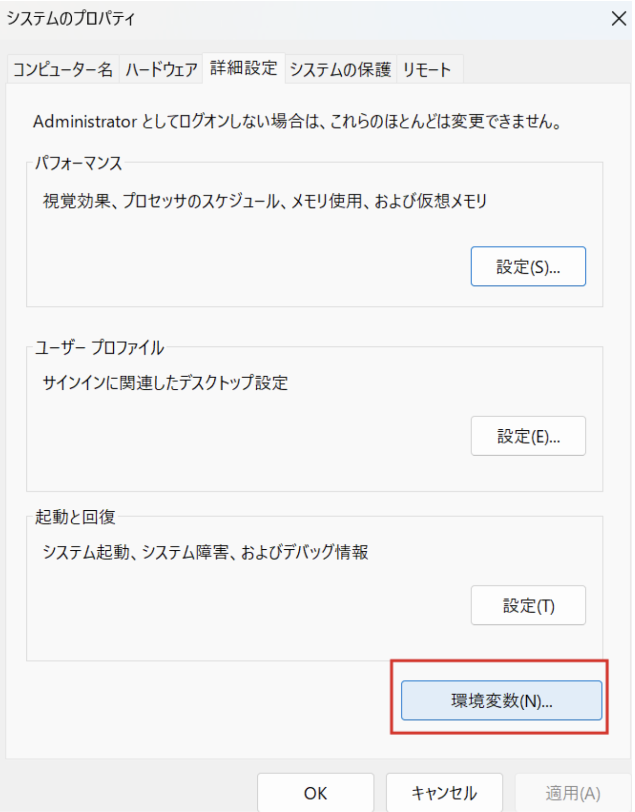

> 💡 **TIPS：gh コマンドが入っていない場合**
> macOS では Homebrew でインストールできる:
>
> ```
> brew install gh
> ```
>
> Windows では winget でインストールできる:
>
> ```
> winget install --id GitHub.cli
> ```
>
> インストールと設定（`gh auth login` など）の参考: `https://qiita.com/s_yasunaga/items/110d21828bd4f578850d`

##### 動作確認

```bash
cd <あなたのプロジェクト>
claude
```
* テーマ選択 → サインイン方法選択（Claude Pro/Max/Enterprise / API キー / Bedrock 等）
* 起動ディレクトリ配下に **すべてアクセスできる** → 機密ディレクトリでは起動しない

起動に成功すると、以下のようなウェルカム画面が表示される。


新しいフォルダで初めて起動すると、**そのフォルダを信頼するか** の確認が表示される。


* Claude Code は起動ディレクトリ配下を **読み取り・編集・コマンド実行** できる。そのための起動時にユーザに確認を行います（ハーネス機能）
* 自分が作った／信頼できるプロジェクト（自分のコード・有名な OSS・チームの成果物）なら `1. Yes, I trust this folder`
* 心当たりのないフォルダなら、中身を確認するまでは `2. No, exit` で抜ける

##### 初回サインイン

* 初回起動時はブラウザが開き、Claude アカウントでのサインイン（サブスクリプションの認証）が行われる

#### 3-2. 起動・終了・再開（3分）

| 操作                     | 方法                                   |
|--------------------------|----------------------------------------|
| 起動                     | プロジェクト直下で `claude`            |
| 終了                     | `Ctrl + C` を 2 回 / `/exit`           |
| **直前の続きから再開**   | `claude --continue`                    |
| 過去のセッションを選んで再開 | `claude -r`（`--resume`）           |
| セッションに名前を付ける | `claude -n <name>`（`--name <name>`）  |
| 非対話で 1 問だけ        | `claude -p "..."`                      |

##### パーミッションスキップ（上級者向け）

| オプション                              | 挙動                                                                 |
|-----------------------------------------|----------------------------------------------------------------------|
| `--dangerously-skip-permissions`        | すべてのパーミッション確認をスキップして実行する                     |
| `--allow-dangerously-skip-permissions`  | スキップを既定では無効のまま、セッション中に選択できるようにする     |

> ⚠️ いずれも **インターネットアクセスのないサンドボックス環境でのみ** 推奨。隔離された環境以外では使わないこと。

#### 3-3. スラッシュコマンド（9分）

まず最初に実施しておきたいコマンドを順に紹介する。

##### `/status` — セッション状態の確認

バージョン・サインイン情報・使用モデル・MCP サーバの状態など、現在のセッションの全体像を一覧表示する。「いま自分がどの環境・どのモデルで動いているか」を最初に確認する習慣をつける。


##### `/config` — 設定の確認・変更

Auto-compact / Thinking mode / 既定のパーミッションモードなど、Claude Code の動作設定を対話的に確認・変更できる。


設定項目の `Language` を変更すると、Claude Code の出力言語を日本語にできる。


##### `/usage` — 利用量の確認

現在のセッション・週単位の利用量（レートリミットの消費状況）を確認できる。リセット時刻も表示されるので、長時間の作業前にチェックすると安心。


##### `/model` — モデルの切り替え

用途に応じてモデルを切り替える。日常タスクは Sonnet、素早い回答が欲しいときは Haiku、といった使い分けができる。


##### `/effort` — 思考の深さの調整

`low` 〜 `max` の5段階で「速さ ⇔ 賢さ」のトレードオフを調整する。簡単な質問は低く、難しい設計判断は高く。


##### `/init` — CLAUDE.md の生成

リポジトリ全体を解析して、プロジェクトメモリ（`CLAUDE.md`）を自動生成する。プロジェクトで最初に一度実行しておくと、以後のセッションで Claude がプロジェクトの構造・規約を踏まえて動くようになる。


生成された `CLAUDE.md` は、**`claude` を起動したディレクトリ（プロジェクトルート）直下** に作成される。

```
<プロジェクトルート>/
├── CLAUDE.md   ← ここに作成される
├── app/
├── routes/
└── ...
```

##### その他の基本コマンド

| コマンド          | 説明                                               |
|-------------------|----------------------------------------------------|
| `/help`           | コマンド一覧                                       |
| `/exit`           | セッション終了                                     |

> 💡 **TIPS：プライバシー設定（Pro / Max プラン加入者）**
> Pro / Max プランを使っている場合は、最初に `/privacy-settings` を実行して設定を確認しておくとよい。ここで **会話データをモデルの学習（トレーニング）に使わせないようにオプトアウト** できる。業務コードを扱うなら、まずこの設定を見直しておくと安心。
> - 学習をオフにすると、データ保持期間も短くなる
> - ウェブからも変更可能：`https://claude.ai/settings/data-privacy-controls`

##### 演習1

紹介したコマンドを実際に実行して、自分の環境を確認・整備する。

1. プロジェクト直下で `claude` を起動する
2. `/status` で バージョン・サインイン状態・使用モデルを確認する
3. `/config` で `Language` を `Japanese` に変更する
4. `/usage` で現在の利用量とリセット時刻を確認する
5. `/model` と `/effort` で現在の設定を確認する（変更してもよい）
6. `/init` を実行して `CLAUDE.md` を生成し、どんな内容が書かれたか眺めてみる

#### 3-4. 承認モードと Plan Mode（3分）

| モード         | ステータスバー表示                  | 挙動                                                                 |
|----------------|-------------------------------------|----------------------------------------------------------------------|
| Default        | （表示なし）`? for shortcuts`       | 標準動作。各ツールの初回使用時に承認を求める                         |
| Accept Edits   | `▶▶ accept edits on`                | ファイル編集と一般的なファイル操作（`mkdir` `mv` `cp` 等）は自動承認、それ以外のコマンドは承認 |
| Plan Mode      | `⏸ plan mode on`                    | **読み取り専用** ツールだけで計画を立てる（編集しない）              |
| Auto           | `▶▶ auto mode on`                   | 安全チェック付きでツール呼び出しを **自動承認**（研究プレビュー）    |

`Shift + Tab` で上記4つを循環切り替え。

##### 使い分けの目安

* 新規領域・本番リポジトリ → **Default**
* テストが厚い既存領域 → **Accept Edits**
* 下調べ・計画したいだけ → **Plan Mode**（**ファイル編集しない**）
* 隔離されたサンドボックスで全部任せたい → **Auto**

> Plan Mode は「コードを書かずに計画だけを出させる」モード。読み取り専用ツールしか使わないので、何回赤入れしても安全。

##### 演習2

* `Shift + Tab` で上記4つのモードを切り替えてみましょう。

### 4. Claude Code を使ってみよう！（6分）

ここまでの内容を使って、実際に Claude Code でアプリを1本作ってみる。題材はシェルスクリプトの「Hello world」。承認モードは Default モードにしておく。

#### 4-1. 起動して依頼する（2分）

空のディレクトリを作って `claude` を起動し、自然言語で依頼する。

```bash
mkdir hello-world && cd hello-world
claude
```

```
「Hello world」と表示するシェルスクリプトを作って
```

#### 4-2. 承認して作らせる（2分）

* Claude がファイル作成の承認を求めてくる → 内容を確認して承認（**Default モードの承認フロー** を体験）
* 作成されたファイル（例：`hello.sh`）の中身を確認する

#### 4-3. 実行して確認する（2分）

```
作ったアプリを実行して、結果を見せて
```

実行前に、以下のような **承認ダイアログ** が表示される。

```
Bash command

  bash hello-world/hello.sh
  Run hello.sh to verify output

This command requires approval

Do you want to proceed?
❯ 1. Yes
  2. Yes, and don't ask again for: bash *
  3. No
```

* **何のコマンドが・何のために** 実行されるかが表示される — 内容を確認してから `1. Yes` で許可する
* `2. Yes, and don't ask again for: bash *` を選ぶと、以後 `bash` コマンドは確認なしで実行される（許可リストに追加される）
* 心当たりのないコマンドなら `3. No` で拒否できる — これが第2章で学んだ **承認モデル（ハーネス）** の実物

* Claude が `bash hello.sh` を実行し、`Hello world` が表示されることを確認する
* **依頼 → 作成 → 実行 → 確認** — 第2章で学んだエージェントループの一周を最小サイズで体験できた

> 💡 指示が曖昧なとき（CLI か Web か、ファイル名はどうするか等）は Claude が **確認の質問** をしてくることがある。勝手に進めないのが Default モードの正常な動き。

> 💡 **TIPS：スピナー（作業中の表示）**
>
> プロンプトを送ると、Claude が作業している間は以下のような **スピナー** が表示される。
> ```
> ✻ Pondering… (12s · ↓ 1.2k tokens · esc to interrupt)
> ```
> * 先頭の単語（Pondering, Brewing, Vibing…）は **ランダムな遊び言葉** で、処理内容とは関係ない
> * **経過時間** と **消費トークン数** が確認できる
> * `esc to interrupt` — **`Esc` でいつでも割り込んで** 指示し直せる（第2章「ループの途中で割り込み」の実物）

> 💡 **TIPS：こんな質問が来たら？**
>
> セッション中、以下のような質問が表示されることがある。Claude の働きぶりについての **任意回答** のフィードバックで、迷ったら **`2: Fine` で OK**（`0: Dismiss` で閉じてもよい）。
> ```
> ● How is Claude doing this session? (optional)
>   1: Bad    2: Fine    3: Good    0: Dismiss
> ```

### 5. コマンド（10分）

#### 5-1. 体系 — 3 種類（4分）

| 種類                | 入り方                              | 例                             |
|---------------------|-------------------------------------|--------------------------------|
| スラッシュコマンド  | REPL 内で `/` を入力                | `/init`, `/context`, `/mcp` |
| 特殊プレフィックス  | プロンプト先頭で `@`, `!`, `#`       | `@README.md`, `!ls`, `# メモ`  |
| キーボードショートカット | キー操作                          | `Shift+Tab`, `Esc`, `Ctrl+R`   |

#### 5-2. 特殊プレフィックス（3分）

##### `!` — Bash 実行モード

```
!pwd
```

* プロンプトとして送らず **シェルだけ実行**。手元の状態を Claude に渡したいときに便利。

##### `#` — メモリ追記

```
# このプロジェクトのテストは bats tests/ で実行する
```

* セッション内メモリに追記される。`/memory` で管理。

##### `@` — ファイル / ディレクトリ参照

```
@README.md このプロジェクトの概要を3行でまとめて
```

* 該当ファイルを **明示的に読ませる**。曖昧さが減ってコンテキストも節約。


#### 5-3. キーボードショートカット（3分）

| キー            | 動作                                          |
|-----------------|-----------------------------------------------|
| `Shift + Tab`   | パーミッションモード循環                        |
| `Ctrl + C`      | 入力クリア / 2回でセッション中断                |
| `Esc`           | 入力クリア・ループ中なら割り込み                 |
| `Ctrl + R`      | 履歴検索                                       |
| `Up / Down`     | 履歴ナビゲーション                              |


### 6. Claude Code の設定ファイル（5分）

Claude Code の挙動は、階層化された設定ファイルで制御される。「どこに置くか」でスコープが変わるのがポイント。

#### 6-1. settings.json（3分）

パーミッション許可リスト・Hooks・環境変数など、**ハーネスの動作設定** を JSON で定義する。

| 配置場所                              | スコープ                                     |
|---------------------------------------|----------------------------------------------|
| `~/.claude/settings.json`             | ユーザ共通（全プロジェクトに適用）           |
| `<repo>/.claude/settings.json`        | プロジェクト共通（**チームで共有**・コミット対象） |
| `<repo>/.claude/settings.local.json`  | プロジェクト個人用（git 管理外）             |

#### 6-2. CLAUDE.md — プロジェクトメモリ（2分）

セッション開始時に **自動で読み込まれる**「Claude への指示書」。`/init` で雛形を生成でき（3-3 参照）、`#` プレフィックスで追記できる。

| 配置場所                     | スコープ                             |
|------------------------------|--------------------------------------|
| `~/.claude/CLAUDE.md`        | 全プロジェクト共通（個人の指示）     |
| `<repo>/CLAUDE.md`           | プロジェクト共通（**チームで共有**） |
| `<repo>/CLAUDE.local.md`     | プロジェクト個人用（git 管理外）     |

##### settings.json と CLAUDE.md の使い分け

| 観点   | settings.json                            | CLAUDE.md                              |
|--------|------------------------------------------|----------------------------------------|
| 形式   | JSON                                     | Markdown（自然言語）                   |
| 役割   | ハーネスの動作設定（許可・Hooks・環境変数） | Claude への指示・プロジェクト知識     |

> 書き方のコツや Hooks の実例など、詳しい運用は **第2回** で扱う。

##### 参考リンク

* [Claude Code ドキュメント — 設定ファイル](https://code.claude.com/docs/ja/settings#%E8%A8%AD%E5%AE%9A%E3%83%95%E3%82%A1%E3%82%A4%E3%83%AB)

### 7. 実践：ソースコードの解析（15分）

題材は **agmsg** — Claude Code・Codex・Gemini CLI などの CLI AI エージェント同士が、共有の SQLite データベースを介してメッセージを交換できるようにする OSS（Bash + SQLite 製）。まず GitHub からクローンして準備する:

```bash
git clone https://github.com/fujibee/agmsg
cd agmsg
```

「構造把握 → 該当箇所の特定 → 深掘り質問 → サマリ取得」の一連の流れを体験する。

> **ポイント**：解析だけが目的なので、`Shift + Tab` で **Plan Mode** にしておくと安全（読み取り専用ツールしか使わない）。

#### 7-1. 構造把握（4分）

プロジェクト直下で `claude` を起動し、まず全体像を聞く。

```
このリポジトリの全体構造と技術スタックを教えて。
ディレクトリごとの役割も簡潔にまとめて。
```

* Claude が `README.md` や `ARCHITECTURE.md`、`scripts/` を自分で読んで回答することを観察する
* **何のファイルを読んだか** がツール実行ログに出る — エージェントループの実物

#### 7-2. 該当箇所の特定（4分）

機能から逆引きで実装箇所を特定させる。

```
エージェントがメッセージを送信したとき、どのスクリプトが実行され、
どこで SQLite データベースに書き込まれるか、該当ファイルと行を特定して。
```

* `scripts/send.sh` → SQLite への書き込み、と追跡されることを確認
* grep 相当の探索を Claude が自律的に行う様子を観察する

#### 7-3. 深掘り質問（4分）

`@` プレフィックスで対象を明示して、ピンポイントに聞く。

```
@scripts/send.sh
このスクリプトがメッセージをどのように保存しているか、
複数エージェントが同時に書き込んだ場合の考慮も含めて説明して。
```

* `@` でファイルを渡すと **曖昧さが減り、探索分のコンテキストも節約** できる

#### 7-4. サマリ取得（3分）

* Plan Mode の解除（書き込み許可）を承認すると、Claude がシーケンス図を Markdown ファイルとして保存する

最後に、解析結果をドキュメントとして残せる形で出力させる。

```
あるエージェントがメッセージを送信してから、別のエージェントが
受信するまでの流れを Mermaid のシーケンス図で出力して。
```

続けて、生成した図をファイルとして残す:

```
Plan Modeを解除してシーケンス図をファイルに保存して
```

> 💡 エディタに Mermaid 形式のビューアが入っていない場合は、**Mermaid Viewer**（`https://mermaidviewer.com/ja`）に出力を貼り付けて図を確認できる。

##### 演習3

* 上記 7-1 〜 7-4 を自分の手で実行する
* 余裕があれば「このコードの改善点を3つ挙げて」と聞いてみる

### 8. まとめ（4分）

#### 第1回の振り返り

| 章 | 学んだこと |
|----|------------|
| 2  | Claude Code は **エージェント型** — コンテキスト収集 → ツール実行 → 検証のループを自走する。基本用語（モデル / コンテキスト / トークン / ハーネス / セッション） |
| 3  | 起動・終了・再開（`--continue` `-r`）、最初に実行するスラッシュコマンド（`/status` `/config` `/usage` `/model` `/effort` `/init`）、4つの承認モード |
| 4  | 自然言語の依頼だけで Hello world アプリを作成 — 依頼 → 作成 → 実行 → 確認のループを体験 |
| 5  | コマンド体系と特殊プレフィックス — `@`（ファイル参照）・`!`（シェル実行）・`#`（メモリ追記） |
| 6  | 設定ファイルの階層 — settings.json（ハーネスの動作設定）と CLAUDE.md（Claude への指示） |
| 7  | ソースコード解析の型 — 構造把握 → 該当箇所の特定 → 深掘り → サマリ取得 |

#### 明日からの最初の一歩

自分の業務リポジトリで `claude` を起動 → `/init` → 「このリポジトリの全体構造を教えて」。
**調査・解析タスクから任せ始める** のが、リスクなく Claude Code に慣れる近道。

### 9. 質疑応答（15分）

ここまでの内容についての質問・疑問に答える。日常業務での適用イメージ（どのタスクから Claude Code に任せるか）もここで相談する。

---

# 第2回：Claude Code を使ったソフトウェア開発

## テーマ

「プロジェクト知識を Claude に定着させ、コード変更を安全に任せる」

## 到達目標

* `CLAUDE.md`・メモリ・`settings.json` の仕組みを理解し、設定が効いているかを確認できる
* プラグインで機能を追加し、skill-creator で自作スキルを作れる
* MCP で外部サービス（Figma）を接続し、デザインからコード生成の流れを理解する
* 題材の OSS（agmsg）への機能追加からレビュー・PR 作成まで、Claude Code との会話で完遂できる

## 時間配分（120分）

| #  | 内容                                       | 時間 |
|----|--------------------------------------------|------|
| 1  | オープニング（到達目標・時間配分の説明）   | 8分  |
| 2  | 設定ファイル（CLAUDE.md・メモリ・settings.json） | 18分 |
| 3  | Skills とプラグイン           | 20分 |
| 4  | MCP                           | 12分  |
| 5  | SubAgent（サブエージェント）  | 12分  |
| 6  | Hooks                         | 12分  |
| 7  | 実践：アプリ開発の一連フロー | 28分 |
| 8  | まとめ                        | 10分  |

---

### 2. 設定ファイル：CLAUDE.md・メモリ・settings.json（18分）

#### 2-1. CLAUDE.md とは（4分）

* セッション開始時に **自動で読み込まれる** プロジェクトの説明書
* 書くべきこと：ビルド・テストコマンド / コーディング規約 / ディレクトリ構成 / 注意事項
* `/init` で雛形を自動生成できる

##### 配置場所と優先順位

| 配置場所                  | スコープ                         |
|---------------------------|----------------------------------|
| `~/.claude/CLAUDE.md`     | 全プロジェクト共通（個人設定）   |
| `<repo>/CLAUDE.md`        | プロジェクト共通（**チームで共有**） |
| `<repo>/CLAUDE.local.md`  | プロジェクト個人用（git 管理外） |

> 💡 **TIPS：AGENTS.md — エージェント指示の業界標準**
> `AGENTS.md` は Cursor / GitHub Copilot / Gemini CLI など 30 以上の AI コーディングツールが共通で読む、ツール非依存の指示ファイルです（Markdown・リポジトリルート配置）。**Claude Code はこれをネイティブでは読み込まず、`CLAUDE.md` だけを読みます。** 複数ツールを併用するチームでは、指示を二重管理しないよう次の方法で橋渡しします:
> - **import**：`CLAUDE.md` に `@AGENTS.md` の1行を書いて取り込みます。Claude 固有のルールは `CLAUDE.md` 側に足せます
>
> 参照：`https://code.claude.com/docs/en/memory`

##### 演習1

1. `CLAUDE.md` の内容を確認する（個人用とプロジェクトの両方を `!cat` で表示する）

   ```
   !cat ~/.claude/CLAUDE.md
   !cat CLAUDE.md
   ```

2. `CLAUDE.md` がまだ無い場合（`/init` が未実行）は、`/init` を実行して生成する

#### 2-2. メモリ（2分）

* `#` プレフィックスでセッション中に得た知見をその場で追記できる

```
# このプロジェクトのテストは bats tests/ で実行する
```

* `/memory` で保存先（CLAUDE.md など）を選択・編集できる

##### プロジェクト別メモリ（auto-memory）

CLAUDE.md とは別に、**Claude が自分で書き溜めるプロジェクト別の記憶** もある。保存先は `~/.claude/projects/<作業ディレクトリ名>/memory/`:

```
~/.claude/projects/<作業ディレクトリ名>/memory/
├── MEMORY.md      ← インデックス（セッション開始時に読み込まれる）
└── <個別メモ>.md   ← 1ファイル1トピックの記憶本体
```

* `~/.claude/projects/` の下に **作業ディレクトリごと** のフォルダ（パスをハイフン区切りにした名前）が作られる
* 同じディレクトリで新しいセッションを始めると自動的に思い出される。**別のディレクトリでの作業には影響しない**

##### 指示・記憶の置き場所の整理

| 場所 | 役割 |
|------|------|
| `~/.claude/CLAUDE.md` | 全プロジェクト共通の **人間からの指示** |
| `<repo>/CLAUDE.md` | リポジトリにコミットする **チーム共有の指示** |
| `~/.claude/projects/<dir>/memory/` | **Claude が自分で書き溜める** プロジェクト別の記憶 |

#### 2-3. CLAUDE.md の書き方のコツ（4分）

* **簡潔に・宣言的に**。長文の経緯説明より「○○するときは△△を使う」
* コードから読み取れること（ファイル構成そのもの等）は書かない — コンテキストの無駄
* 守られなかった指示は **表現を強める** より **理由を添える** ほうが効く

##### 演習2

* 以下の記入例を参考に、`CLAUDE.md` に「テストコマンド」「コーディング規約」を追記する

`claude` を起動して依頼する:

```
$ claude
```

```
リポジトリのCLAUDE.mdファイルへ以下の記載を追記して
```

記入例（agmsg の場合）:

```markdown
## テストコマンド

- 全テスト実行: `bats tests/`
- 単一ファイル: `bats tests/test_send.bats`
- 静的解析: `shellcheck scripts/*.sh`

## コーディング規約

- シェルスクリプトは先頭で `set -euo pipefail` を宣言する
- 変数展開は必ずダブルクォートで囲む（`"$var"`）
- SQLite への値の埋め込みは文字列連結ではなくパラメータ化する
- 新しいスクリプトには対応する bats テストを追加する
```

#### 2-4. settings.json と設定の確認（8分）

**パーミッション許可リスト・Hooks・環境変数など、ハーネスの動作設定** を JSON で定義する。

| 配置場所                              | スコープ                                 |
|---------------------------------------|------------------------------------------|
| `~/.claude/settings.json`             | ユーザ共通（全プロジェクトに適用）       |
| `<repo>/.claude/settings.json`        | プロジェクト共通（チームで共有・コミット対象） |
| `<repo>/.claude/settings.local.json`  | プロジェクト個人用（git 管理外）         |

第1回で settings.json の配置場所（user / project / local）に触れた。ここでは **書ける主な項目** と、**設定が効いているかの確認方法** を押さえる。

主な設定キー:

| キー | 役割 |
|------|------|
| `permissions` | ツール実行の許可/拒否/確認（`allow` / `deny` / `ask`） |
| `hooks` | ツール実行の前後に差し込むコマンド（6章） |
| `env` | セッションに渡す環境変数 |
| `model` | 既定モデル |
| `outputStyle` | 応答スタイル |
| `enabledPlugins` / `extraKnownMarketplaces` | プラグイン・マーケットプレイスの設定（3章） |
| `includeCoAuthoredBy` | コミットに `Co-Authored-By` を付けるか |
| `cleanupPeriodDays` | セッション履歴の保持日数 |

`permissions` は allow / deny / ask の3種で書く:

```json
{
  "permissions": {
    "allow": ["Bash(bats:*)"],
    "deny": ["Read(./.env)", "Bash(rm -rf *)"],
    "ask": ["Bash(git push:*)"]
  }
}
```

* `allow`=確認なしで許可 / `deny`=実行不可 / `ask`=毎回確認
* `:*` は末尾ワイルドカード。`Bash(bats:*)` は `bats tests/test_send.bats` のように後ろに何が続いても一致する（`bash` など別コマンドは対象外）。`**` は複数階層のパスにマッチ
* よく使う安全なコマンドを `allow` に登録しておくと、**承認ダイアログの往復が減ってテンポが上がる**（承認時に「Yes, and don't ask again」を選ぶと自動追記される）

##### 設定の確認方法

設定は user → project → local の順に重ねられ、**より近い設定が勝つ**（local > project > user）。いま何が効いているかは次のコマンドで確認する:

| コマンド | 確認できること |
|----------|----------------|
| `/config` | 現在の設定を UI で確認・変更（model, theme, language など）。変更内容は settings.json に保存される |
| `/permissions` | 許可/拒否ルールをスコープ別に確認・編集 |
| `/hooks` | 有効なフック設定を確認 |
| `/memory` | 読み込まれている `CLAUDE.md`・メモリを確認 |
| `/status` | バージョン・モデル・接続状態の全体像 |

> 💡 組織が配布する managed settings は最優先で、個人設定では上書きできない。`settings.json` は **JSON でハーネスを強制設定** するもの、`CLAUDE.md` は **Markdown で Claude に指示** するもの、という役割分担を意識する。

### 3. Skills とプラグイン（20分）

#### 3-1. Skills とは（2分）

* **手順書をスキル化** して `/<スキル名>` で呼び出せる仕組み。実体は `.claude/skills/<スキル名>/SKILL.md`
* 「毎回プロンプトで説明していた定型作業」をコマンド一発にできる
* 自分で書くほかに、**プラグインで配布されたスキルを入れる**・**skill-creator に作ってもらう** という選択肢がある
* **プラグイン** ＝ スキル・サブエージェント・Hooks・MCP 接続などの拡張を **ひとまとめにして配布する入れ物**。`/plugin` で導入・管理する
* **マーケットプレイス** ＝ プラグインの配布カタログ。Anthropic 公式の **claude-plugins-official** のほか、GitHub リポジトリをマーケットプレイスとして登録すればチーム独自の配布元も持てる（第3回で扱う）

#### 3-2. プラグインを入れて機能を足す（5分）

**プラグイン** ＝ スキル・エージェント・Hooks・MCP サーバーをまとめた配布パッケージ。マーケットプレイスから入れる。公式マーケットプレイス `claude-plugins-official` は最初から利用できる。

例として、Claude の変更を自動でセキュリティレビューする `security-guidance` を入れてみる:

```
/plugin install security-guidance@claude-plugins-official
/reload-plugins
```

* `/plugin` を実行すると **Discover / Installed / Marketplaces / Errors** のタブ型 UI で管理できる
* `security-guidance` は導入後、Claude のコード変更を自動でレビューし、見つけた問題をその場で直すよう促す（明示的に呼び出さなくても効く）

##### 演習3

* `security-guidance` を install → `/reload-plugins` → `/plugin` の **Installed** タブで入ったことを確認する

#### 3-3. skill-creator でスキルを作る（5分）

手書きで `SKILL.md` を書いてもよいが、**skill-creator** プラグインを使うと **対話的にスキルを作れる**。

```
/plugin install skill-creator@claude-plugins-official
/reload-plugins
```

`/skill-creator` を呼び出し、作りたいスキルを言葉で伝える:

```
テストを生成する test-gen というスキルを作って。
対象のファイルを引数で受け取り、リポジトリの既存テスト形式に合わせて
正常系・異常系のテストを作成し、テストが通るまで直す手順にして。
```

* skill-creator が `SKILL.md` と必要な補助ファイルを生成してくれる
* **Create / Eval / Improve / Benchmark** の4モードがあり、作成だけでなく評価・改善まで支援する

作成された `test-gen` の中身を確認する:

```
!ls ~/.claude/skills/test-gen/
!cat ~/.claude/skills/test-gen/SKILL.md
```

* どんなファイルが生成され、`SKILL.md` に何が書かれたかを眺めておく（構成の意味は次の 3-4 で扱う）

> 💡 **スキルの置き場所**：自作スキル（`/test-gen` 等）は `~/.claude/skills/` に置いておくと **どのプロジェクトでも呼び出せる**（リポジトリ内の `.claude/skills/` はそのプロジェクト専用）。

#### 3-4. スキルのフォルダ構成（4分）

スキルは「**1ディレクトリ＝1スキル**」。エントリは `SKILL.md`（必須）で、**ディレクトリ名がそのままコマンド名**になる（`test-gen/` → `/test-gen`）。

| 配置場所 | スコープ |
|----------|----------|
| `~/.claude/skills/<name>/SKILL.md` | 個人（全プロジェクトで使える） |
| `<repo>/.claude/skills/<name>/SKILL.md` | プロジェクト（チームで共有） |

`SKILL.md` は YAML frontmatter ＋ Markdown 本文:

```markdown
---
name: test-gen
description: 指定したファイルのテストを生成する。テスト追加を頼まれたときに使う。
allowed-tools: Read, Edit, Bash
---

（ここに手順を Markdown で書く）
```

* `name`＝表示名 / `description`＝Claude が **自動起動を判断する鍵**（具体的に書く）/ `allowed-tools`＝確認なしで使えるツール
* 補助ファイルを同梱できる:

```
test-gen/
├── SKILL.md        ← 必須・エントリ
├── reference.md    ← 詳細リファレンス
├── templates/      ← 雛形
└── scripts/        ← 実行スクリプト
```

* **`description` だけが常時ロードされ、本文や補助ファイルは呼ばれたときだけ読まれる**（遅延ロード）。長い資料を同梱してもコンテキストをほとんど消費しない。

#### 3-5. 組み込みスキル（2分）

自作・導入しなくても、Claude Code には **組み込みスキル** が同梱されている。

* 同梱スキルは **オンデマンドで展開** される — スキルが実際に呼び出されたタイミングで、参照用ファイル（examples 等）だけが一時ディレクトリ（`bundled-skills/` 配下）に書き出される。本文（SKILL.md）はファイルとしてではなく、**会話に直接注入** される
* 呼び出していないスキルは展開されないため、ファイルとしては見えない

主な組み込みスキル（呼び出し可能なもの）:

| スキル                     | 用途                                       |
|----------------------------|--------------------------------------------|
| `code-review`              | 差分のバグ・改善点レビュー                 |
| `security-review`          | ブランチ変更のセキュリティレビュー         |
| `review`                   | Pull Request のレビュー                    |
| `verify`                   | 変更が実際に動くかアプリを起動して検証     |
| `run`                      | プロジェクトのアプリを起動して動作を確認   |
| `simplify`                 | 変更コードの簡素化・リファクタリング       |
| `init`                     | CLAUDE.md の初期生成                       |
| `deep-research`            | Web検索を束ねた詳細リサーチレポート作成    |
| `loop` / `schedule`        | 定期実行・スケジュール実行                 |
| `update-config`            | settings.json の設定変更                   |
| `keybindings-help`         | キーバインドのカスタマイズ                 |
| `claude-api`               | Claude API のリファレンス参照              |
| `fewer-permission-prompts` | 権限プロンプト削減のための許可リスト生成   |

#### 3-6. マーケットプレイス（2分）

`/plugin` から導入できる Anthropic 公式マーケットプレイス（claude-plugins-official）の主なプラグイン:

**UI・フロントエンド**

- `frontend-design`：ありがちな AI 生成っぽさを避けた本番向け UI を作るためのプラグインです
- `playground`：視覚的に試せる HTML プレイグラウンドを作る用途です

**開発関連**

- `agent-sdk-dev`：Claude Agent SDK のアプリ開発・検証向けです
- `commit-commands`：コミット、push、PR 作成をコマンド化します
- `feature-dev`：7段階の機能開発フローを支援します
- `ralph-loop`：自己参照的な AI 開発ループを回すためのものです

**コードレビュー・品質管理**

- `code-review`：複数エージェントで PR を自動レビューします
- `code-simplifier`：コードを読みやすく整理します
- `pr-review-toolkit`：コメント、テスト、エラー処理などに特化したレビューをします
- `security-guidance`：危険な編集やセキュリティ上の注意を知らせます

**Claude Code の拡張開発**

- `example-plugin`：機能サンプルです
- `plugin-dev`：hooks、MCP、構造、公開までを扱う開発キットです
- `skill-creator`：スキル作成・改善・評価に使います

**設定・管理**

- `claude-code-setup`：コードベースを見て、Claude Code の自動化を提案します
- `claude-md-management`：CLAUDE.md の保守を支援します
- `hookify`：会話パターンや指示からフックを作ります

### 4. MCP（12分）

#### 4-1. MCP とは（4分）

* **MCP（Model Context Protocol）** ＝ Claude Code に **外部サービスやツールを接続する標準規格**
* 接続すると、その外部サービスの操作が「ツール」として Claude から使えるようになる（GitHub・Slack・Figma・DB など）
* 接続方法は2つ: ① **プラグイン経由**（公式マーケットプレイスの外部連携プラグイン）/ ② `claude mcp add` で直接追加

##### `/mcp` コマンド

接続した MCP サーバーの管理は `/mcp` で行う。

| できること | 内容 |
|------------|------|
| 状態の確認 | 接続済みサーバーの一覧と状態（`connected` / `needs auth` / `failed`）を表示 |
| 認証 | サーバーを選んで **Authenticate** → OAuth 認可（認証が必要なサーバー向け） |
| ツールの確認 | そのサーバーが提供するツール一覧を確認 |
| 有効/無効・再接続 | サーバーの有効化/無効化や、切れた接続の再接続 |

> 💡 起動画面の「MCP servers: ◯ need auth」表示や `/status` からも状態が分かる。うまく動かないときは **まず `/mcp` で `connected` になっているか** を確認する。

#### 4-2. Figma MCP を接続する（4分）

Figma 公式の MCP（リモート）を、3章で学んだ **プラグイン機構** で導入する:

```
/plugin install figma@claude-plugins-official
/reload-plugins
```

続いて `/mcp` を実行し、認証（OAuth）を済ませる:

```
/mcp
```

サーバー一覧が表示される。導入直後の `plugin:figma:figma` は **needs authentication**（要認証）の状態:

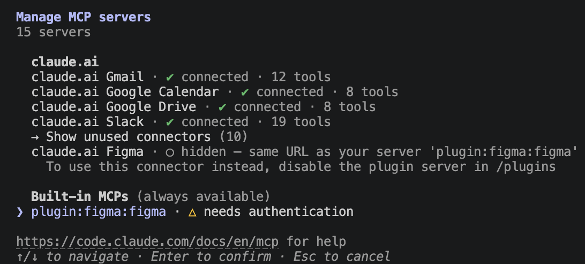

`plugin:figma:figma` を選ぶとサーバーの詳細が表示されるので、**1. Authenticate** を実行する:

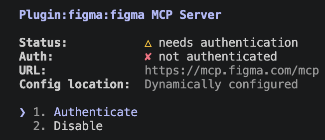

ブラウザで Figma の認可画面が開く。内容を確認して **「同意してアクセスを許可する」** をクリック:

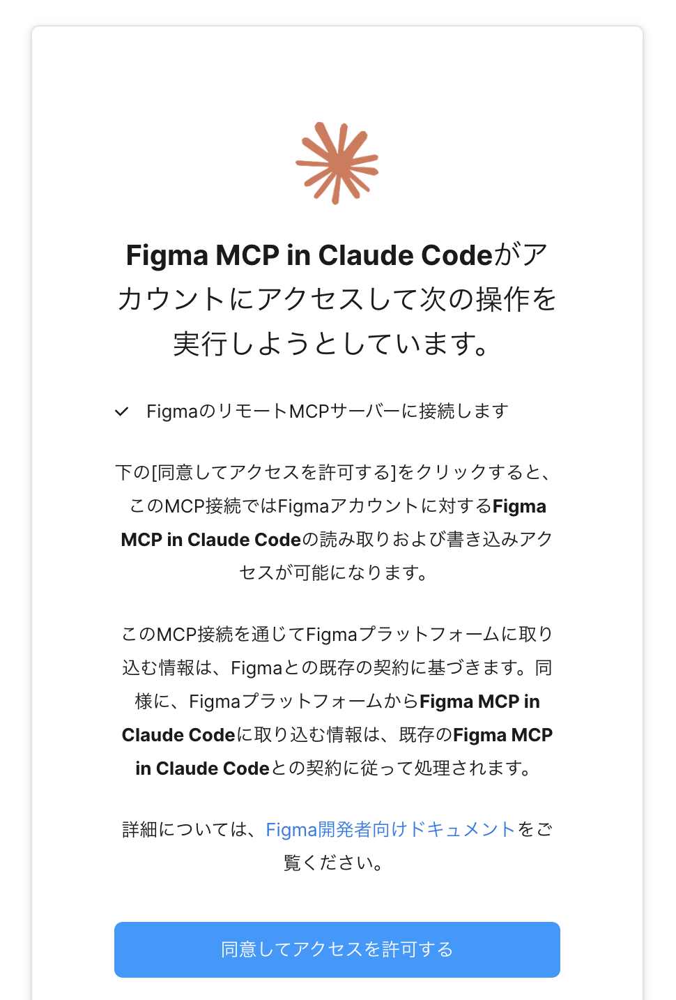

**Authentication successful** が表示されたら、タブを閉じて Claude Code に戻る:

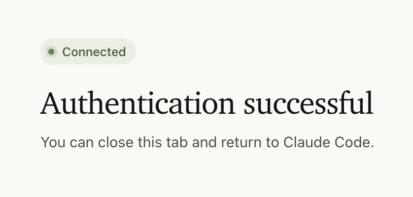

再度 `/mcp` を開き、`plugin:figma:figma` が **connected**（例: 25 tools）になっていれば接続完了。リモート方式なので **デスクトップアプリ不要・無料プランでも試せる**:

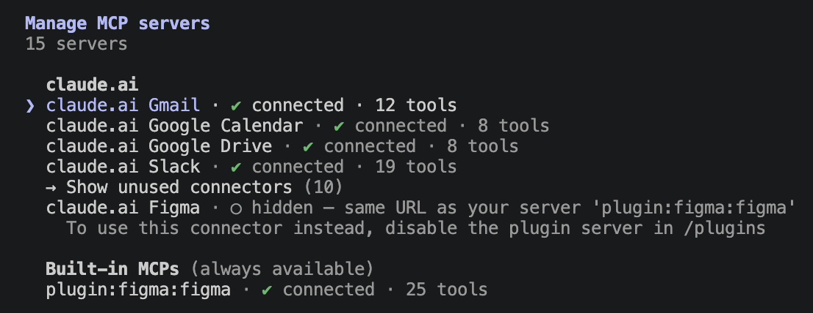

> 💡 プラグインを使わず直接追加する場合: `claude mcp add --transport http figma https://mcp.figma.com/mcp`
> 💡 ローカル（デスクトップ）方式は Figma デスクトップアプリ＋Dev 席（有料プラン）が必要。

#### 4-3. ハンズオン：サンプルデザイン（AI Chat）をコードにする（4分）

自分でデザインを用意しなくても試せるよう、Figma 標準ライブラリ **Simple Design System** のサンプル画面（Examples/AI Chat）を使う。

まず Figma で **新規デザインファイル** を作成し（ドラフト・無料プランで OK）、左サイドバーの **アセット** タブから **Simple Design System / Examples** を開く。About / AI Chat / Article / Contact Us などのサンプル画面が並んでいる:

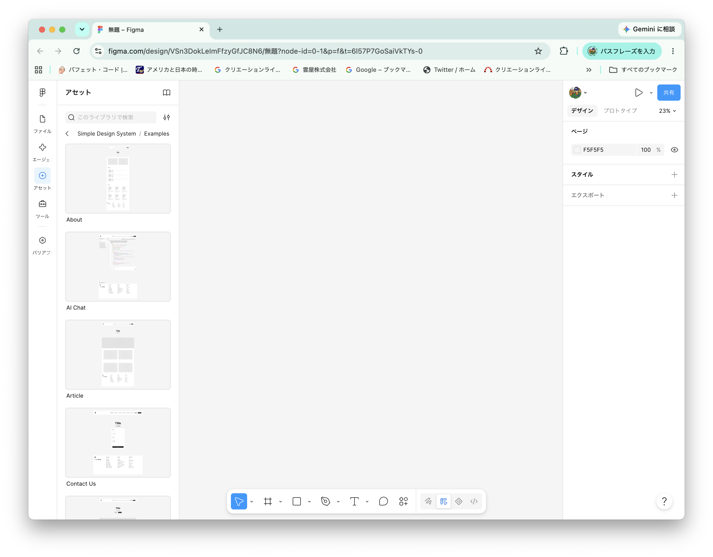

**AI Chat** を選び、詳細パネルの **「インスタンスを挿入」** をクリックする:

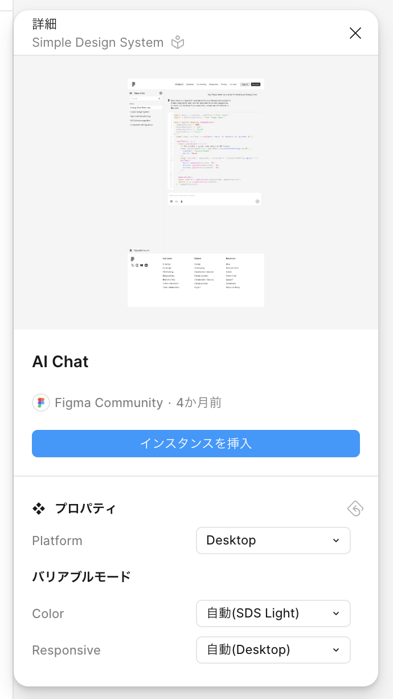

キャンバスに AI チャット画面のサンプル（Examples/AI Chat）が配置される:

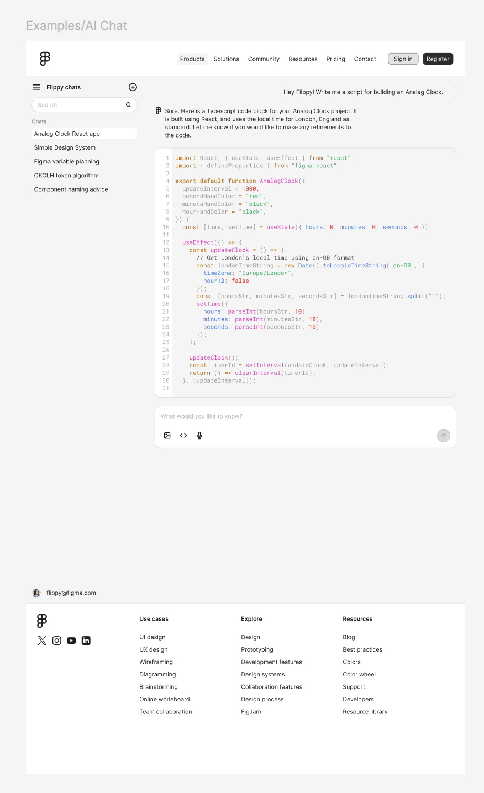

あとで Claude に指示しやすいよう、ファイル名を「無題」から **AI Chat** に変更しておく（ファイル名横の ∨ メニュー → **名前を変更**）:

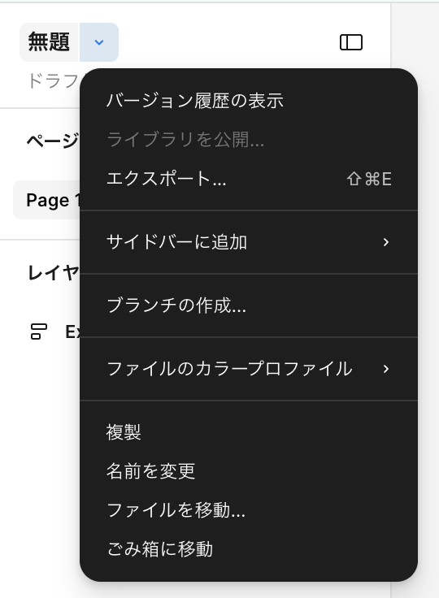

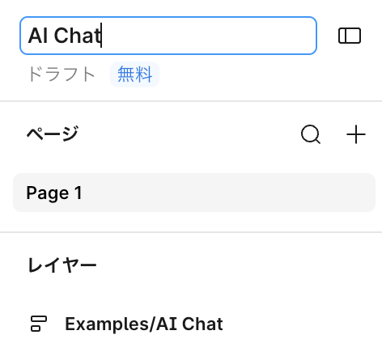

準備ができたら、Claude Code に実装を依頼する:

```
Figmaの「AI Chat」ファイルのExamples/AI Chatの内容をもとにHTML + Tailwind CSS
で実装して（リンク貼り付け）。色やスペーシングはデザインのトークンに合わせて。
```

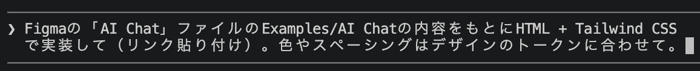

「（リンク貼り付け）」の部分には、Examples/AI Chat のフレームを選択した状態でコピーした **node-id 付き URL**（例: `https://www.figma.com/design/xxxx/AI-Chat?node-id=1-1402`）を貼る。貼り忘れても Claude が URL を求めてくるので、そこで渡せばよい:

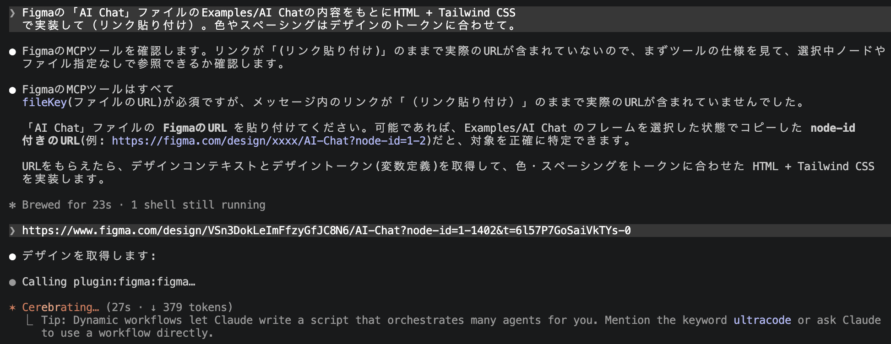

* Claude が figma の `get_design_context`（コード生成）・`get_variable_defs`（色/サイズ等のトークン抽出）・`get_screenshot`（選択範囲の画像）などのツールを呼び、デザインからコードを生成する

##### 演習4

* アセットに並ぶ他のサンプル（Article・Contact Us など）を挿入し、同じ流れでコード生成を試す

### 5. SubAgent（サブエージェント）（12分）

#### 5-1. SubAgent とは（4分）

* **サブエージェント** ＝ メイン会話とは **別の独立したコンテキスト** で動く AI アシスタント。専用の **システムプロンプト・ツール権限・モデル** を持てる
* 大量の出力が出る作業（全文検索・全テスト実行・複数ファイルのレビュー・ログ調査など）を任せても、**メイン会話にはサマリーだけ返る** — コンテキストを汚さない
* 組み込みのサブエージェントもある：`Explore`（高速・読み取り専用の探索）/ `Plan`（計画用）/ `general-purpose`（調査＋修正の汎用）

> 💡 **スキル / プラグイン との違い**：スキルは **メイン会話の中** で手順を実行する。サブエージェントは **別コンテキストで実行してサマリーだけ返す**。プラグインはそれらをまとめて配布する入れ物。

**サブエージェントのメリット**

* **コンテキスト節約**：大量出力（検索結果・diff・ログ）を別コンテキストに隔離し、メイン会話にはサマリーだけ返る → 本筋の文脈が長持ちする
* **専門化で精度向上**：観点を絞ったシステムプロンプト＋必要なツールだけに制限でき、レビュー／調査／デバッグなど用途特化の質が上がる
* **並列化で高速**：複数のサブエージェントを同時に走らせ、調査やレビューをまとめて進められる
* **時間のかかるタスクに有効**：全テスト実行や大規模なログ調査など長時間かかる処理をバックグラウンドで任せられ、その間もメイン会話で別の作業を進められる
* **再利用・共有**：`.claude/agents/` に置けばプロジェクト／チームで使い回せる
* **安全性**：ツール権限を絞れる（例：読み取り専用のレビュアーにして書き込みをさせない）

#### 5-2. サブエージェントの作成（4分）

作り方は2つ:

* ① **Claude に自然言語で頼む**（「シェルスクリプトのコードレビューをするサブエージェントを作って」のように依頼）
* ② `.claude/agents/` に **Markdown ファイルを直接作成する**

> 💡 以前あった `/agents` ウィザード（対話的な作成 UI）は **廃止された**。`/agents` を実行すると、上記2つの方法への案内が表示される。

実体は Markdown ファイル。配置場所でスコープが決まる:

| 配置場所 | スコープ |
|----------|----------|
| `~/.claude/agents/<name>.md` | 個人（全プロジェクト） |
| `<repo>/.claude/agents/<name>.md` | プロジェクト（チームで共有） |

例として、レビュー専用サブエージェントを Claude に頼んで作る。プロンプトに続けて、ファイルに書く内容も一緒に渡す:

```
「シェルスクリプトのシニアコードレビュアー」を作って。
ファイルは .claude/agents/shell-code-reviewer.md で、内容は以下にして。
```

```markdown
---
name: shell-code-reviewer
description: シェルスクリプトのコードレビュー専門家。コードを書いた/変更した直後に積極的に使う。
tools: Read, Grep, Glob, Bash
model: sonnet
---

あなたはシェルスクリプトのシニアコードレビュアーです。次の観点でレビューしてください：
1. クォート漏れ（変数展開が "$var" になっているか）
2. エラーハンドリング（set -euo pipefail、失敗時の後始末）
3. SQLite への値の埋め込み（文字列連結によるインジェクションがないか）
4. 移植性（macOS / Linux での挙動差、bash 依存の明示）
5. テストの不足

指摘ごとに「観点 / 該当ファイル・行 / 問題のコード / 理由 / 修正案」を示すこと。
```

* frontmatter：`name`・`description`（委譲判断の鍵）は必須。`tools`（省略時は全ツール継承）・`model`（省略時は `inherit`）は任意

#### 5-3. ハンズオン：レビュー専用サブエージェントを使う（4分）

上の `shell-code-reviewer` を作成し（または Claude に「シェルスクリプトのコードレビュー用サブエージェントを作って」と頼んで生成し）、呼び出してみる。

```
shell-code-reviewer エージェントで scripts/ の変更をレビューして
```

* サブエージェントが別コンテキストで該当コードを読み込み・レビューし、**メイン会話には結果のサマリーだけ** 返ることを観察する
* 「○○と△△モジュールを別々のサブエージェントで並行調査して」のように **複数を並列実行** させることもできる

**実行中の表示**

委譲すると、メイン画面に **別タスクとして実行中の状態** が表示される:

```
● shell-code-reviewer(scripts/ の変更をレビュー)
  ⎿ Running… (18s · ↓ 4.2k tokens · esc to interrupt)
```

* 実行中は **エージェント名・経過時間・消費トークン** が表示され、終わると **結果のサマリーだけ** がメイン会話に差し込まれる（途中の大量の読み込み・diff は残らない）
* `Esc` で実行を中断できる

### 6. Hooks（12分）

#### 6-1. Hooks とは（4分）

* ツール実行の **前後などに自動でコマンドを差し込む** 仕組み（`settings.json` に定義）
* CLAUDE.md の指示と違い、**ハーネスが機械的に実行する** — Claude が「忘れる」ことがない
* 代表的なフックポイント：

| フック        | タイミング                 | 用途例                          |
|---------------|----------------------------|---------------------------------|
| `PreToolUse`  | ツール実行の直前           | 危険なコマンドのブロック        |
| `PostToolUse` | ツール実行の直後           | フォーマッタ・リンタの自動実行  |
| `Stop`        | Claude が応答を終えたとき  | テストの自動実行・完了通知      |

> 💡 フックが **終了コード 2** で終わると、その出力が Claude にフィードバックされる。PreToolUse ならツール実行がブロックされ、PostToolUse なら **Claude が出力を読んで自分で修正** する — これが品質向上ループの鍵。

#### 6-2. 例：パッケージの install / update をブロック（PreToolUse）（4分）

`npm` / `pnpm` / `bun` によるパッケージの追加・更新は、依存の増加やロックファイルの変更を伴う。レビューなしに走らせたくない操作を、`PreToolUse` で **実行前に検知して止める**。

`.claude/settings.json`：

```json
{
  "hooks": {
    "PreToolUse": [
      {
        "matcher": "Bash",
        "hooks": [
          { "type": "command", "command": ".claude/hooks/block-package-install.sh" }
        ]
      }
    ]
  }
}
```

`.claude/hooks/block-package-install.sh`：

```bash
#!/usr/bin/env bash
# 実行されようとしている Bash コマンドは stdin に JSON で渡ってくる
command=$(jq -r '.tool_input.command')

# npm / pnpm / bun のインストール・アップデート系サブコマンドを検知
if echo "$command" | grep -Eq '\b(npm|pnpm|bun)\b[[:space:]]+(install|i|add|update|upgrade|up)\b'; then
  echo "パッケージの install / update はブロックしています。依存を変えるなら人間に相談してください。" >&2
  exit 2
fi
exit 0
```

* `npm install` / `pnpm add` / `bun update` などを検知したら **終了コード 2 でブロック**。理由は Claude に伝わるので、勝手に依存を足さず相談・代替手段へ切り替える
* 「何を入れる・何を上げるか」は人間が握る、というガバナンスを **機械的に担保** するのが Hooks の本質

#### 6-3. コード品質を高める Hooks 実例（4分）

##### 危険なコマンドのブロック（PreToolUse）

```json
{
  "hooks": {
    "PreToolUse": [
      {
        "matcher": "Bash",
        "hooks": [
          { "type": "command", "command": ".claude/hooks/guard.sh" }
        ]
      }
    ]
  }
}
```

* `guard.sh` 内で `git push --force` や `rm -rf` などを検知したら **終了コード 2 でブロック**。ブロック理由は Claude に伝わるので、安全な代替手段を取り直す

##### レシピまとめ

| 目的                     | フック                      | コマンド例                       |
|--------------------------|-----------------------------|----------------------------------|
| コード整形の強制         | `PostToolUse`（Edit/Write） | `shfmt -w scripts/`              |
| 静的解析（ShellCheck）   | `PostToolUse`（Edit/Write） | `shellcheck scripts/*.sh`        |
| テストの自動実行         | `Stop`                      | `bats tests/`                    |
| 危険コマンドのブロック   | `PreToolUse`（Bash）        | 検知スクリプトで `exit 2`        |

### 7. 実践：アプリ開発の一連フロー（28分）

**個人開発のフロー** を最初から最後まで回す。題材の agmsg をクローン → 機能追加（メッセージ検索） → レビュー → 修正 → テスト生成 → セキュリティレビュー → クローン元リポジトリへの PR 作成まで、すべて Claude Code との会話で進める。

#### 7-1. 題材（agmsg）をクローン（2分）

改修の題材は **agmsg**（第1回のソースコード解析で使った、CLI AI エージェント間のメッセージングツール）。GitHub からクローンして準備する:

```
$ git clone https://github.com/kimotuki/agmsg
$ cd agmsg
$ claude
```

* 以降のステップ（機能追加・レビュー・修正）は、この **クローンしたリポジトリを対象** に進める
* 第1回の「ソースコード解析」と同じ題材なので、構造を把握済みならスムーズに改修へ入れる

#### 7-2. 「メッセージ検索」機能を追加（8分）

```
このagmsgに「メッセージ検索」機能を追加してください。
scripts/search.sh として、キーワードで過去のメッセージを検索できるようにして。
```

実装が終わったら、どのような変更が入ったかを `git diff` で **人の目で確認する**:

```
!git status
!git diff
```

* 新規ファイルの一覧は `git status`、既存ファイルの差分は `git diff` で見る。意図しない変更が混ざっていないかを確認する

#### 7-3. 組み込みスキルでレビュー（4分）

3-5 で紹介した組み込みスキル `/code-review` でレビューする。

```
/code-review
```

* `/code-review` を実行する — 未コミットの差分に対して、バグ・エッジケース・改善点のレビューが返ってくる
* 妥当な指摘があれば「指摘の1番を修正して」と依頼し、修正された差分を確認する

#### 7-4. レビュー内容を修正（3分）

```
レビュー指摘のうち、○番と○番を直して
```

修正が終わったら、変更内容を `git diff` で **人の目で確認する**:

```
!git diff
```

* 直した内容が新たな指摘を生んでいないか、必要なら再度 `/code-review` をかける

#### 7-5. 自作スキルでテストを生成してレビュー（3分）

3-3 で作った自作スキル `/test-gen` で、追加した検索機能のテストを生成して検証する。

```
/test-gen scripts/search.sh
```

* 正常系・異常系のテストが `tests/` に生成され（agmsg のテストは bats 形式）、テストが通るまで修正される
* レビューは組み込みスキル、テスト生成は自作 `/test-gen` のように、**組み込みスキルでカバーされない定型作業は自作スキルで作っていく**

#### 7-6. 組み込みスキルでセキュリティレビュー（4分）

組み込みスキル `/security-review` で、現在のブランチの変更にセキュリティ上の問題がないかをレビューする。

```
/security-review
```

* SQL インジェクション・XSS・認証/認可漏れ・機密情報のハードコードなど、**脆弱性の観点** でレビューしてくれる
* `/code-review`（バグ・改善点）と `/security-review`（セキュリティ）は **観点が違う** — 両方かけると安心
* 3章で `security-guidance` プラグインを入れていれば、編集のたびに **自動でも** 同様のチェックが走る

#### 7-7. リポジトリへコミット、PR 作成（4分）

修正をコミットし、クローン元（`kimotuki/agmsg`）へ PR を作成する:

```
!git checkout -b feature/message-search-[自分の名前]
!git add -A && git commit -m "メッセージ検索機能の追加 by [自分の名前]"
# クローン元 (kimotuki/agmsg) に向けた PR を作成
!gh pr create --fill
```

* クローン元には書き込み権限がないため、`gh pr create` が push 先を聞いてくる — **「Create a fork of kimotuki/agmsg」を選ぶ** と、fork の作成 → push → PR 作成まで一気に進む（初回のみ `gh auth login`）
* `--fill` はコミットメッセージから PR のタイトル・本文を自動生成する
* ブランチ名・コミットメッセージ・PR 本文は Claude に任せてもよい（「クローン元に PR を作って」）

#### 7-8. オプション課題

* 余裕があれば「メッセージ統計」機能も追加する — 「エージェントごとの送信数を集計する scripts/stats.sh を追加して」

### 8. まとめ（10分）

* `CLAUDE.md` は **Claude への引き継ぎ書** — 簡潔・宣言的に保つ。`settings.json` は **ハーネスの強制設定**（`/config` `/permissions` `/hooks` で確認）
* **プラグイン** で機能を足し、**skill-creator** で自作スキルを作り、**Hooks** で品質担保を自動化する
* **MCP** で外部サービス（Figma など）を接続すると、Claude の作業範囲が広がる
* **SubAgent** で重い調査・レビューを別コンテキストに逃がし、メイン会話を汚さない
* コード変更は **Plan Mode で計画 → 承認 → 小さく実装 → テスト** のリズムで

---

# 第3回：Claude Code を使ったチーム開発

## テーマ

「個人の使いこなしをチームの標準にし、コンテキストを管理して長く走る」

## 到達目標

* CLAUDE.md / Skills / settings をチームで共有・運用できる
* `/context` `/compact` `/clear` を使い分けてコンテキストを管理できる
* Issue 起点のチーム開発フロー（Issue → ブランチ → fix → レビュー → PR → マージ）を Claude Code で回せる

## 時間配分（60分）

| #  | 内容                                       | 時間 |
|----|--------------------------------------------|------|
| 1  | オープニング（到達目標・時間配分の説明）   | 5分  |
| 2  | チームでの CLAUDE.md 運用                  | 10分 |
| 3  | Skills の共有                     | 10分 |
| 4  | コンテキスト管理                  | 12分 |
| 5  | 実践：チーム開発フロー            | 12分 |
| 6  | 実践：チーム開発フローの自動化    | 6分  |
| 7  | まとめ・コース総括                | 5分  |

---

### 2. チームでの CLAUDE.md 運用（10分）

#### 2-1. 共有の基本方針（5分）

* `<repo>/CLAUDE.md` を **リポジトリにコミット** してチーム全員で共有する
* 個人の好み（エディタ設定・出力スタイル等）は `CLAUDE.local.md` か `~/.claude/CLAUDE.md` へ
* CLAUDE.md の変更も **PR でレビュー** する — 「Claude への指示」はチームの規約そのもの

#### 2-2. 運用のアンチパターン（5分）

| アンチパターン                     | 対策                                       |
|------------------------------------|--------------------------------------------|
| 何でも書いて肥大化                 | 定期的に棚卸し。コードから分かることは消す |
| 個人ルールの混入                   | `CLAUDE.local.md` に分離                   |
| 書いたきり更新しない               | 規約変更・構成変更と同じ PR で更新         |

### 3. Skills の共有（10分）

#### 3-1. 共有できるもの（4分）

| 対象                       | 配置場所                  | 共有方法           |
|----------------------------|---------------------------|--------------------|
| Skills                     | `.claude/skills/`         | リポジトリにコミット |
| Hooks・パーミッション設定  | `.claude/settings.json`   | リポジトリにコミット |
| 個人用設定                 | `.claude/settings.local.json` | git 管理外     |

#### 3-2. チームでの活用例（3分）

* テスト生成の手順を `/test-gen` スキルとして共有 → **テスト観点の平準化**
* `PostToolUse` でリンタを強制 → **「Claude が書いてもチーム標準のコード」を担保**
* 新メンバーのオンボーディング：`claude` を起動して「このプロジェクトの開発の流れを教えて」

##### 演習1

* 第2回で作った `test-gen` スキルをコミットし、隣の受講者のリポジトリで動かしてもらう

#### 3-3. プラグイン（3分）

Skills / Hooks / 設定を **まとめて配布できる単位** が **プラグイン**。`.claude/` への手動コミットより、バージョン管理・更新が楽で、マーケットプレイス経由で導入できる。

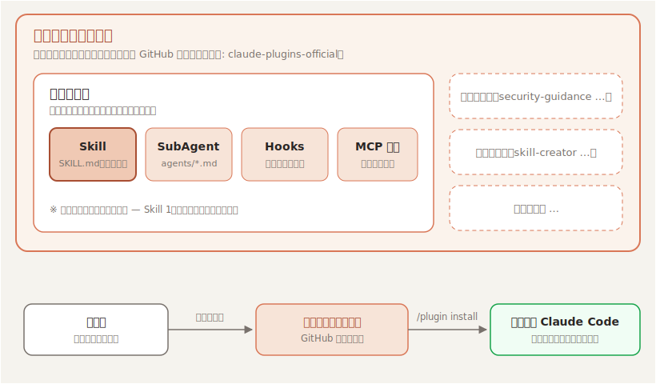

* **Skill** ＝ 手順書の最小単位（`SKILL.md`）。プラグインに同梱して配布できる
* **プラグイン** ＝ Skills・SubAgent・Hooks・MCP 接続を **ひとまとめにした配布の入れ物**
* **マーケットプレイス** ＝ プラグインの **配布カタログ**（実体は GitHub リポジトリ。例: `claude-plugins-official`）
* 共有の流れ：作成者がプラグインをマーケットプレイスに登録 → 利用者は `/plugin marketplace add` で登録 → `/plugin install` で導入

##### セキュリティレビューを自動化する `security-guidance` プラグイン

公式マーケットプレイス（`claude-plugins-official`）の `security-guidance` プラグインは、**Claude が行う各変更を脆弱性観点でレビューし、見つけた問題を同じセッション内で修正させる**。チーム全員が入れておけば、誰が書いても一定のセキュリティ水準が担保される。

**基本インストール**

Claude Code のセッション内で以下を実行する:

```
/plugin install security-guidance@claude-plugins-official
```

マーケットプレイスが見つからない場合は、先に登録する:

```
/plugin marketplace add anthropics/claude-plugins-official
```

インストール後、現在のセッションに即時適用する:

```
/reload-plugins
```

* **user スコープ** を選ぶと、同一マシンのすべてのセッションで自動的に読み込まれる
* `/plugin` を実行すると、Discover / Installed / Marketplaces / Errors のタブでプラグインを管理できる

**チーム・プロジェクト全体への適用**

リポジトリに `.claude/settings.json` を追加すると、そのリポジトリをクローンした全員に自動適用される:

```json
{
  "enabledPlugins": {
    "security-guidance@claude-plugins-official": true
  }
}
```

* Claude Code on the Web（クラウドセッション）では **user スコープのプラグインが引き継がれない** ため、プロジェクト設定（上記）への記述が必要
* 組織全体に展開する場合は、管理者が **マネージド設定** で `enabledPlugins` を設定する

> 💡 プラグインは **任意のコードを実行できる**。導入は信頼できるマーケットプレイス・作者のものに限ること。

### 4. コンテキスト管理（12分）

#### 4-1. なぜ管理が必要か（3分）

* コンテキストウィンドウは **有限**（トークン上限がある）
* 埋まると自動コンパクション（要約圧縮）が走り、**細部の情報が失われる**
* 長いセッションで「さっき言ったことを忘れる」のは大半これが原因

主要モデルのコンテキストウィンドウ:

| モデル           | コンテキストウィンドウ | 最大出力 |
|------------------|------------------------|----------|
| Claude Fable 5   | 100万トークン          | 128K     |
| Claude Opus 4.8  | 100万トークン          | 128K     |
| Claude Sonnet 5  | 100万トークン          | 128K     |
| Claude Haiku 4.5 | 20万トークン           | 64K      |

* コンテキストウィンドウ ＝ モデルが一度に扱える情報量の上限。**会話履歴だけでなく、CLAUDE.md・読み込んだスキル・ツールの実行結果もすべてここを消費する**
* 上限はモデルごとに異なり、大きいモデルでも「無限」ではない

#### 4-2. 3つのコマンド（5分）

| コマンド     | 動作                                   | 使いどころ                             |
|--------------|----------------------------------------|----------------------------------------|
| `/context`   | 現在のコンテキスト使用量を可視化       | 長い作業の途中で残量チェック           |
| `/compact`   | 会話を要約して圧縮（指示も添えられる） | 作業は続けたいが残量が心配なとき       |
| `/clear`     | コンテキストを完全リセット             | 別タスクに切り替えるとき               |

```
/compact 実装方針とテスト結果は残して、探索の過程は要約して
```

#### 4-3. 運用のコツ（4分）

* **1タスク1セッション** が基本 — タスクが変わったら `/clear`
* 大事な決定事項は `#` で CLAUDE.md に書き出してから `/clear` する（**外部メモリ化**）
* コンパクションに頼るより、**自分で要点を保存して新しいセッションを始める** ほうが品質が安定する

> 💡 **TIPS：設定もコンテキストを消費する**
> CLAUDE.md の肥大化や Skill を多く登録することも、セッション開始時からコンテキストを消費する。適時最小化を心掛けながら環境を整えていくことが重要。

##### 演習2

* `/context` で現在の使用量を確認 → `/compact` を指示付きで実行 → 使用量の変化を見る

### 5. 実践：チーム開発フロー（12分）

題材：チーム共有のリポジトリ（例：第2回で使った `agmsg` の fork から1つ選ぶ）に対して、**Issue 起点の開発フロー** を一周する。

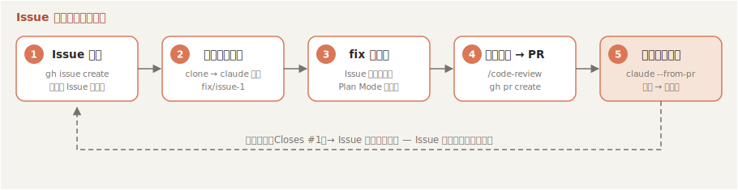

#### 5-1. gh で Issue を作成（2分）

```
「README に日本語のクイックスタートを追記してほしい」という Issue を gh で作成して
```

* `gh issue create` が実行される — タイトル・本文も Claude が整えてくれる
* **Issue 本文がそのまま Claude への要件になる** — 再現手順や期待動作を丁寧に書くほど後工程の精度が上がる

#### 5-2. clone してブランチを作成（2分）

チームのリポジトリを clone し、Issue 対応のブランチを切る。

```bash
git clone <チームのリポジトリURL>
cd <リポジトリ名>
claude
```

```
Issue #1 に対応するブランチを切って
```

* `gh issue view 1` で内容を確認し、`fix/issue-1` のようなブランチが作られる

#### 5-3. Issue に対する fix を実装（3分）

```
Issue #1 を読んで、Plan Mode で対応方針を立ててから修正して
```

* Claude が Issue 本文を読み、計画を提示 → レビューして承認 → 実装 → テスト
* 人間は **計画と差分のレビュー** に集中する

#### 5-4. スキルでレビューして PR を作成（2分）

push する前に、組み込みスキルで自己レビューする。

```
/code-review
```

* 指摘があれば修正してから PR を作成：

```
Issue #1 を closes する PR を作成して
```

* PR 本文に `Closes #1` が入り、**マージすると Issue が自動クローズ** される

#### 5-5. 他の人の PR をレビューしてマージ（3分）

受講者同士で PR 番号を交換し、互いの PR をレビューする。`claude --from-pr <N>` で **PR の文脈（差分・説明文・レビューコメント）を読み込んだ状態** でセッションを開始できる。

```bash
claude --from-pr <N>   # N はレビューする PR 番号
```

```
/review
```

* 指摘があれば PR にコメントを残す（「レビュー結果を PR にコメントして」）
* PR の作者は `claude --from-pr <自分のPR番号>` で起動し、「レビューコメントに対応して」→ 修正 → push
* 問題がなくなったらマージ：

```
この PR をマージして
```

* `gh pr merge` が実行され、`Closes #1` により Issue も自動クローズ — **Issue 起点のフローが一周** する

### 6. 実践：チーム開発フローの自動化（6分）

5章で回した「Issue 起点の開発フロー」は毎回同じ手順の繰り返し — つまり **スキル化の好対象**。フロー全体を1つのスキルに落とし込み、1コマンドで回せるようにする。

```
issue-flow というスキルを作って。Issue 番号を引数で受け取り、
1. gh issue view で Issue の内容を確認
2. fix/issue-<番号> ブランチを作成
3. Plan Mode で対応方針を立ててから修正を実装
4. /code-review でレビューし、妥当な指摘を修正
5. コミットして PR を作成（本文に Closes #<番号> を入れる）
という手順にして。
```

作成できたら、新しい Issue を1つ作って実行してみる:

```
/issue-flow 2
```

* 定型フローをスキル化すれば、**チームの誰でも同じ品質のフローを1コマンドで再現** できる
* `.claude/skills/issue-flow/` をコミットすれば、3章で学んだとおりチーム全員に共有される

### 7. まとめ・コース総括（5分）

#### 第3回のまとめ

* CLAUDE.md・Skills・settings は **リポジトリにコミットしてチームの資産** にする
* コンテキストは有限 — `/context` で監視し、`/compact` と `/clear` を使い分ける
* 人間の仕事は **計画のレビューと差分のレビュー** に寄っていく

#### コース総括

| 回    | 身につけたこと                                         |
|-------|--------------------------------------------------------|
| 第1回 | エージェントの仕組み・基本コマンド・ソースコード解析   |
| 第2回 | CLAUDE.md / Skills / Hooks・安全なコード変更の進め方   |
| 第3回 | チームでの共有・コンテキスト管理・PR ベースの開発フロー |

ここから先は **日常業務で使い続けること** が最良の学習。まずは「調査・解析タスク」から Claude Code に任せてみよう。
